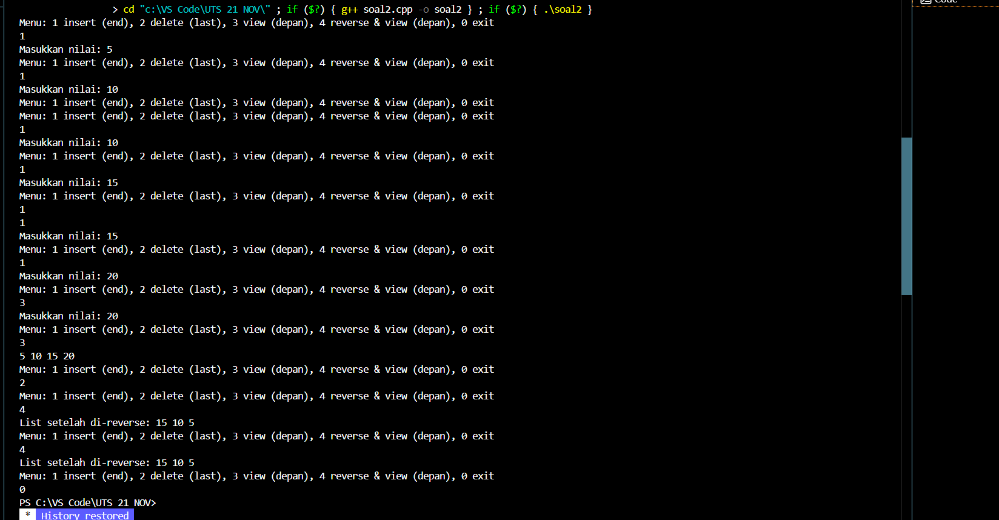

UJIAN TENGAH SEMESTER
PRAKTIKUM STRUKTUR DATA
CLO 3

Identitas Pengumpul

Nama: M Rafi Maulana Fadhlurrahman

NIM: 103112400264

Kelas: IF12-05 struktur data

SOAL:2

1. Kode Program

Berikut adalah kode program untuk [jelaskan singkat tujuan kode, misal: "program C++ untuk mengecek bilangan ganjil/genap"].

(Silakan ganti bahasa dan kode di bawah ini sesuai tugas Anda)

```File: main.cpp
 * Author: M Rafi Maulana Fadhlurrahman
 * NIM: 103112400264
 * Deskripsi: Program untuk implementasi Doubly Linked List
 * yang diinput oleh user 
 */
#include <iostream>
using namespace std;

struct Node {
    int data;
    Node* prev;
    Node* next;//pointer ke node berikutnya
};

Node* head = nullptr;//pointer ke node pertama
Node* tail = nullptr;//pointer ke node terakhir

//insert akhir
void insertAkhir(int x) {
    Node* baru = new Node{x, nullptr, nullptr};
    if (head == nullptr) {//jika list kosong
        head = tail = baru;//jika list kosong, head & tail menunjuk ke node baru
        return;
    }
    tail->next = baru;
    baru->prev = tail;
    tail = baru;
}

//delete terakhir
void deleteLast(){
    if (tail == nullptr) return;//jika list kosong
    if (head == tail) {//jika hanya ada satu node
        delete tail;//menghapus node terakhir
        head = tail = nullptr;//
        return;
    }
    Node* hapus = tail;
    tail = tail->prev;//pindah tail ke node sebelumnya
    tail->next = nullptr;//memutuskan link ke node terakhir
    delete hapus;
}
//melihat dari depan ke belakang
void viewDepan() {
    Node* temp = head;
    while (temp != nullptr) {  //iterasi sampai akhir
        cout << temp->data << " ";//menampilkan data
        temp = temp->next;//iterasi maju
    }
    cout << endl;
}
//reverse tanpa node baru
void reverseList(){
    Node* temp = head;//mulai dari head
    while (temp != nullptr) {//iterasi sampai akhir
        Node* next = temp->next;
        //tukar pointer
        temp->next = temp->prev;
        temp->prev = next;//iterasi ke node berikutnya
        temp = next;
    }
    //swap head & tail
    Node* swapTemp = head;
    head = tail;
    tail = swapTemp;
}

int main() {
int menu;
while (true) {
    cout << "Menu: 1 insert (end), 2 delete (last), 3 view (depan), 4 reverse & view (depan), 0 exit\n";
    cin >> menu;
    if (menu == 0) break;
    if (menu == 1) {
cout << "Masukkan nilai: ";
int x;
cin >> x;
insertAkhir(x);
}
else if (menu == 2) {
    deleteLast();
}
else if (menu == 3) {
    viewDepan();
}
else if (menu == 4) {
    reverseList();
cout << "List setelah di-reverse: ";
viewDepan();
     }
           }
return 0;
}
```

2. Penjelasan Kode

Berikut adalah penjelasan alur logika dari kode program di atas:


Tujuan: implementasi double-linked list dengan operasi insert di akhir, delete terakhir, view dari depan, dan reverse list (in-place).
Struktur data:
struct Node: menyimpan int data dan pointer prev/next.
head/tail: pointer global ke node pertama/terakhir (inisialisasi nullptr).

insertAkhir(int x):
Buat node baru (data=x, prev/next diatur).
Jika list kosong set head=tail=baru; else sambungkan ke tail dan update tail.
Kompleksitas: O(1).

deleteLast():
Jika kosong: return.
Jika satu node: delete dan set head=tail=nullptr.
Jika >1: pindah tail ke prev, putuskan link next, delete node lama.
Kompleksitas: O(1).

viewDepan():
Iterasi dari head lewat next dan cetak data sampai nullptr.
Kompleksitas: O(n).

reverseList():
Untuk setiap node: tukar next dan prev, lalu lanjutkan menggunakan saved next.
Setelah loop swap head dan tail. Melakukan reverse in-place tanpa alokasi baru.
Kompleksitas: O(n).

main():
Loop menu interaktif: 1 insert, 2 delete, 3 view, 4 reverse+view, 0 exit.
Input via cin >> menu dan cin >> x untuk insert.
Catatan singkat / saran:
Tidak ada pembersihan memori saat exit (node tidak di-delete) — tambah fungsi clearAll() untuk mencegah memory leak.

3. Output Program

Berikut adalah hasil eksekusi program (output) ketika dijalankan.
```
Output
 
```

4. Penjelasan Lanjutan (Analisis Output)

- Menu 1 (insert akhir): Menambahkan elemen ke akhir list.
berfungsi sebagai menambahkan node di akhir dan memmbuat node baru  dan memeriksa jik node kosong akan kembali ke node baru

- Menu 2 (delete terakhir): Menghapus elemen terakhir dari list.
pertama sistem akan mengcek list apakah kosong tidak dan jika ada 1 node dan menghapus node terakhir
akan pindah ke link node terakhir
- Menu 3 (view depan): Menampilkan isi list dari depan ke belakang.
iterasi akan melihat dari awal sampe akhir dan menampilkan data 
menu ini berguna sebagai 
- Menu 4 (reverse & view): Membalik urutan list dan menampilkannya
akan mulai dari awal dan sampe akhir dan akan ke iterasi sampai node berikutnya

5. Kesimpulan

Berdasarkan implementasi dan pengujian kode di atas, dapat disimpulkan bahwa:

- Kode ini membuat dan memanipulasi double linked list dengan operasi dasar: insert di akhir, delete terakhir, tampilkan, dan reverse.
- Fungsi reverseList() membalik urutan list tanpa membuat node baru, hanya dengan menukar pointer next dan prev.
- Cocok untuk belajar struktur data dinamis, pointer, dan manipulasi linked list secara efisien.
