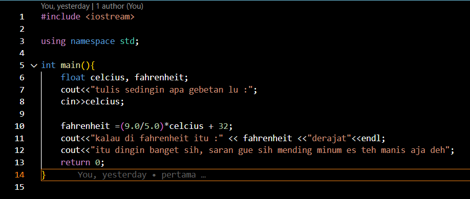
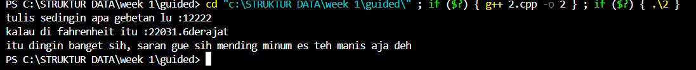
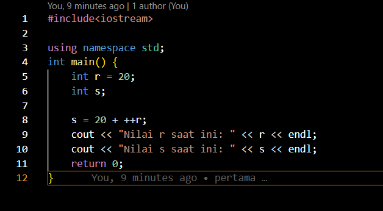
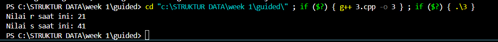
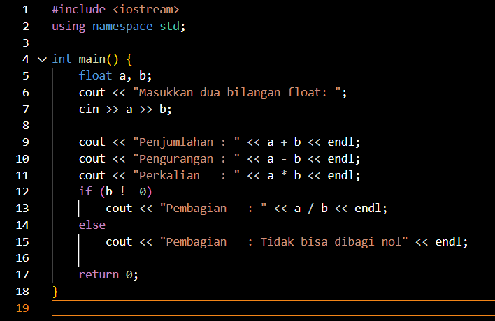
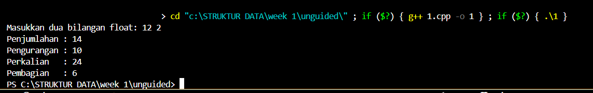
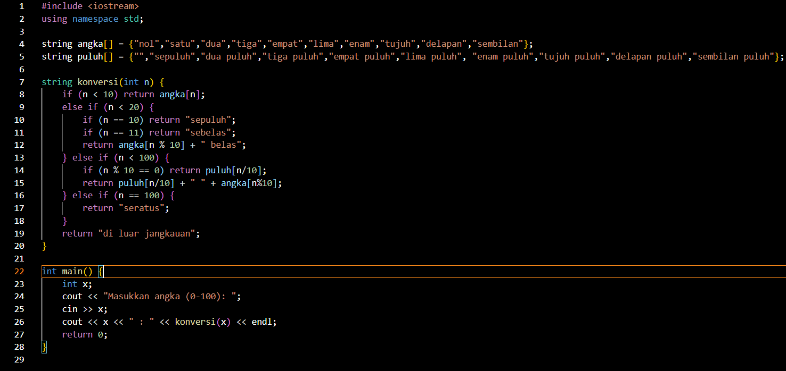
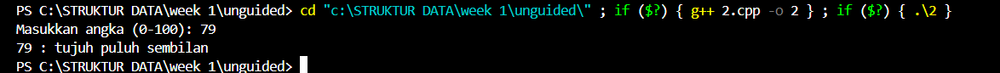
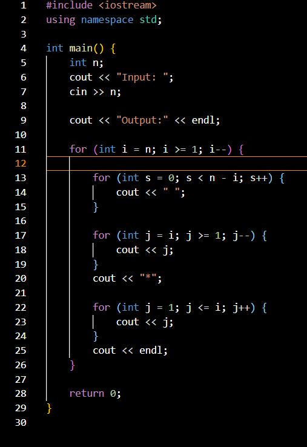
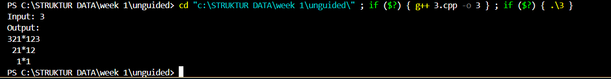

# Laporan Praktikum Struktur Data

## 1. Nama, NIM, Kelas
- **Nama**: M Rafi Maulana Fadlurrahman
- **NIM**: 103112400264
- **Kelas**: IF12-05

## 2. Motivasi Belajar Struktur Data
Struktur Data merupakan salah satu fondasi penting dalam ilmu komputer. Oleh karena itu, saya berkomitmen untuk mempelajarinya secara mendalam agar dapat meningkatkan kemampuan analisis dan pemrograman saya.

## 3. Dasar Teori
Contoh: Struktur data adalah cara untuk menyimpan dan mengorganisir data dalam komputer agar dapat digunakan secara efisien. Berikut adalah teori dasar mengenai **Graf** dan **Pohon**:

- **Graf**: Merupakan struktur data yang digunakan untuk menggambarkan hubungan antar objek yang disebut simpul (vertex) dan hubungan antar simpul yang disebut busur (edge).
- **Pohon**: Struktur data hierarkis yang terdiri dari simpul dan tepi, dengan satu simpul sebagai akar.

## 4. Guided
### 4.1 Guided 1

Program C++ tersebut meminta pengguna memasukkan total belanja, lalu memeriksa apakah jumlahnya mencapai Rp30.000 atau lebih; jika ya, program menghitung diskon 10% dari total belanja dan menampilkan besarnya diskon beserta pesan “orang kaya lu bujang”, sedangkan jika jumlahnya kurang dari Rp30.000 program menetapkan diskon nol dan menampilkan pesan “maaf kamu tidak punya uang, belanja lagi ya bujang”, sehingga kode ini pada dasarnya menerapkan percabangan if-else sederhana untuk menentukan pemberian diskon.

ouput :

### 4.2 Guided 2

Program C++ ini meminta pengguna memasukkan suhu dalam satuan Celcius (dengan humor “tulis sedingin apa gebetan lu”), kemudian mengonversinya ke Fahrenheit dengan rumus (9.0/5.0)*celcius + 32, lalu menampilkan hasil konversi tersebut diikuti pesan lucu “itu dingin banget… mending minum es teh manis aja deh”, sehingga secara inti kode ini adalah program konversi suhu Celcius ke Fahrenheit menggunakan input dan output sederhana.

output :

### 4.3 Guided 3

Program C++ ini mendeklarasikan r dengan nilai awal 20 lalu menghitung s dengan rumus 20 + ++r; operator ++r adalah pre-increment yang menaikkan r dulu baru dipakai dalam perhitungan, sehingga r menjadi 21 dan s bernilai 20 + 21 = 41; kemudian program menampilkan nilai r (21) dan s (41) ke layar.

output :
!
## 5. Unguided
### 5.1 Unguided 1

Program operasi dua bilangan float membaca dua input, lalu menampilkan hasil penjumlahan, pengurangan, perkalian, dan pembagian; khusus untuk pembagian ada pengecekan agar tidak terjadi pembagian dengan nol, sehingga output selalu valid.
output :

### 5.2 Unguided 2

Program konversi angka ke tulisan (0–100) dibuat dengan membagi kasus: angka 0–11 langsung dicetak dari array kata dasar, angka 12–19 dicetak dengan pola “(satuan) belas”, angka kelipatan 10 dicetak dari array puluhan, angka 21–99 dicetak gabungan “puluhan + satuan”, dan khusus 100 dicetak “seratus”, sehingga tiap input akan otomatis ditulis dalam bentuk kata yang sesuai.
output :

### 5.3 Unguided 3

Program mirror di atas bekerja dengan mencetak angka secara menurun di sisi kiri, bintang di tengah, lalu angka menaik di sisi kanan, dan supaya hasilnya rata tengah ditambahkan spasi di depan tiap baris sesuai selisih antara baris sekarang dengan nilai input, sehingga pola turun ke bawah membentuk segitiga simetris dengan * tetap di tengah.
output :

## 6. Kesimpulan
Kesimpulan dari praktikum ini adalah tujuan pembelajaran tercapai karena setiap soal berhasil diimplementasikan dengan baik menggunakan C++, mulai dari operasi bilangan float, konversi angka ke tulisan, hingga pembuatan pola mirror. Teori yang dipelajari dapat dipahami karena langsung dipraktikkan dalam bentuk kode sederhana: penggunaan operasi aritmatika untuk float, logika percabangan untuk konversi angka, serta perulangan bersarang untuk mencetak pola. Dengan cara ini, konsep dasar pemrograman seperti input-output, if-else, dan loop bisa dipahami lebih mudah karena langsung terlihat hasilnya di layar.

## 7. Referensi
1. Abdul Kadir, Dasar Pemrograman C++.