# Laporan Praktikum Struktur Data

## 1. Nama, NIM, Kelas
- **Nama**: M Rafi Maulana Fadlurrahman
- **NIM**: 103112400264
- **Kelas**: IF12-05

## 2. Motivasi Belajar Struktur Data
Struktur Data merupakan salah satu fondasi penting dalam ilmu komputer. Oleh karena itu, saya berkomitmen untuk mempelajarinya secara mendalam agar dapat meningkatkan kemampuan analisis dan pemrograman saya.

## 3. Dasar Teori
Struktur data adalah cara untuk menyimpan dan mengorganisir data dalam komputer agar dapat digunakan secara efisien. Berikut adalah teori dasar mengenai Multi Linked List dan Circular Linked List:

Multi Linked List merupakan struktur data dinamis yang terdiri dari sekumpulan list yang berbeda namun memiliki keterhubungan satu sama lain. Dalam implementasi studi kasus data Pegawai, struktur ini memodelkan hubungan hierarkis di mana elemen pada List Induk (Pegawai) bertindak sebagai parent yang memiliki pointer khusus untuk menunjuk ke List Anak. Hal ini memungkinkan setiap simpul pada List Induk untuk memiliki daftar elemen anaknya sendiri secara independen. Secara teknis, implementasi ini menggunakan struktur Doubly Linked List baik untuk induk maupun anak, ditandai dengan adanya pointer next dan prev yang memungkinkan penelusuran data dilakukan dua arah (maju dan mundur). Operasi pada Multi Linked List memiliki aturan ketergantungan yang ketat; misalnya, saat melakukan penghapusan elemen induk, maka seluruh elemen anak yang berelasi dengan induk tersebut juga harus dihapus secara otomatis.

Sementara itu, Circular Linked List adalah variasi dari linked list di mana elemen terakhir (Last) tidak menunjuk ke NULL sebagai penanda akhir, melainkan kembali menunjuk ke elemen pertama (First), sehingga membentuk siklus tertutup atau lingkaran. Struktur ini diterapkan pada studi kasus data Mahasiswa yang menyimpan informasi Nama, NIM, Jenis Kelamin, dan IPK. Berbeda dengan list linear biasa, penelusuran pada Circular List tidak memiliki ujung mati; iterasi elemen dilakukan dengan memeriksa apakah pointer next dari simpul saat ini telah kembali ke alamat elemen pertama. Hal ini sangat berguna untuk aplikasi yang membutuhkan perputaran data yang terus-menerus tanpa perlu mereset pointer ke awal secara manual.
## 4. Guided
### 4.1 Guided 1
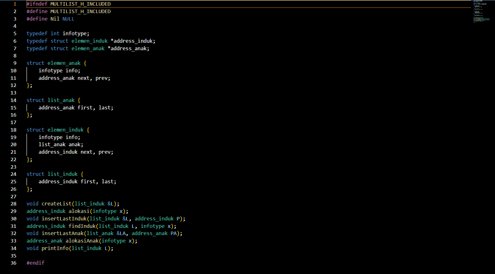

File multilist.h bertindak sebagai antarmuka utama yang mendefinisikan kerangka kerja struktur data Multi Linked List, dimulai dengan penggunaan header guards dan definisi tipe data untuk menjamin konsistensi penamaan di seluruh program. Inti dari file ini terletak pada pendefinisian empat struct utama, yaitu struct elemen_anak dan struct list_anak sebagai sub-list, serta struct elemen_induk yang dirancang unik karena memiliki field khusus bertipe list_anak, sehingga menciptakan hubungan hierarkis di mana setiap simpul induk secara otomatis "menggendong" list anaknya sendiri. Seluruh struktur ini kemudian dikelola oleh struct list_induk dan didukung oleh serangkaian deklarasi prototipe fungsi atau ADT (Abstract Data Type) yang mencakup manajemen memori, operasi dasar pembuatan list, hingga manipulasi data seperti insert, delete, dan search, yang memungkinkan logika program antara data Induk dan Anak dapat diimplementasikan secara modular namun tetap terintegrasi.

### 4.1 Guided 2

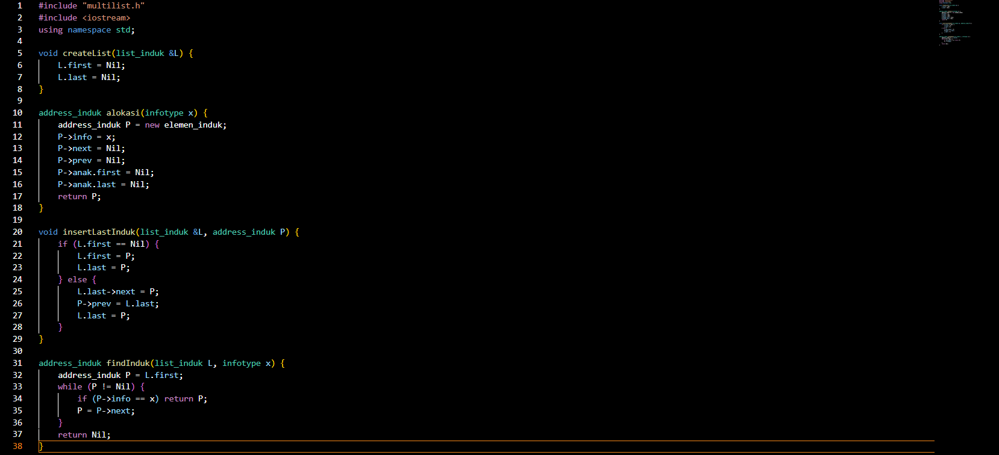

File multilist.cpp merupakan unit implementasi utama yang berisi logika operasional untuk manajemen List Induk dalam struktur Multi Linked List. Di dalamnya terdapat realisasi teknis dari fungsi-fungsi primitif, dimulai dari fungsi alokasi yang bertugas memesan memori untuk elemen induk sekaligus menginisialisasi pointer list anak di dalamnya agar siap digunakan (set NULL). File ini menangani seluruh manipulasi data pada level induk menggunakan algoritma Doubly Linked List standar seperti pengaturan pointer next dan prev pada prosedur insert dan delete serta menyediakan fungsi printInfo yang menerapkan logika perulangan bersarang (nested loop) untuk menelusuri setiap node induk dan kemudian mengakses sub-list anaknya guna menampilkan seluruh hierarki data secara terstruktur.
### 4.3 Guided 3
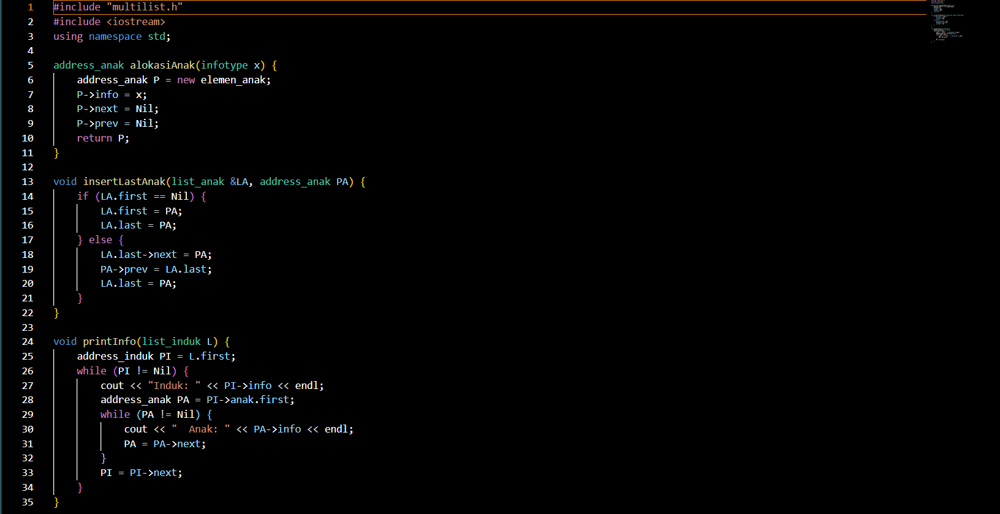

File multilist_anak.cpp berperan sebagai modul spesifik yang menangani seluruh operasi manajemen data pada level sub-list atau List Anak, memisahkannya dari logika utama List Induk agar kode lebih terstruktur. Di dalamnya terdapat implementasi teknis untuk alokasi memori (alokasiAnak) guna membentuk node anak baru, serta serangkaian prosedur manipulasi data meliputi penambahan (insert) dan penghapusan (delete) elemen di posisi awal maupun akhir list. Seluruh operasi dalam file ini bekerja berdasarkan mekanisme Doubly Linked List, memanfaatkan pointer next dan prev untuk menghubungkan antar elemen anak, sehingga pengelolaan data bawahan dapat dilakukan secara dinamis dan independen sebelum nantinya dihubungkan ke induk yang relevan.

### 4.3 Guided 4
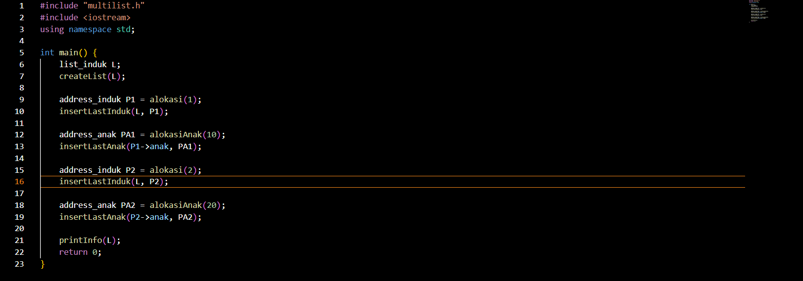

File main.cpp bertindak sebagai program penggerak utama (driver code) yang berfungsi untuk menguji integrasi dan fungsionalitas dari struktur data Multi Linked List yang telah didefinisikan sebelumnya. Di dalam file ini, struktur list induk diinisialisasi terlebih dahulu, diikuti dengan alokasi memori untuk menciptakan beberapa node induk dan node anak. Poin krusial dalam file ini adalah demonstrasi pembentukan relasi hierarkis, di mana node-node anak disisipkan secara spesifik ke dalam field list anak milik pointer induk tertentu (misalnya menggunakan P1->anak), membuktikan bahwa setiap induk dapat menampung sub-list data yang berbeda secara independen sebelum akhirnya seluruh struktur data ditampilkan ke layar untuk verifikasi .

outputnya
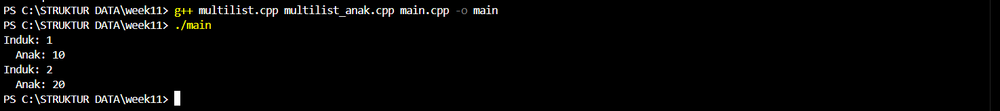

## 5. Unguided
### 5.1 unguided1
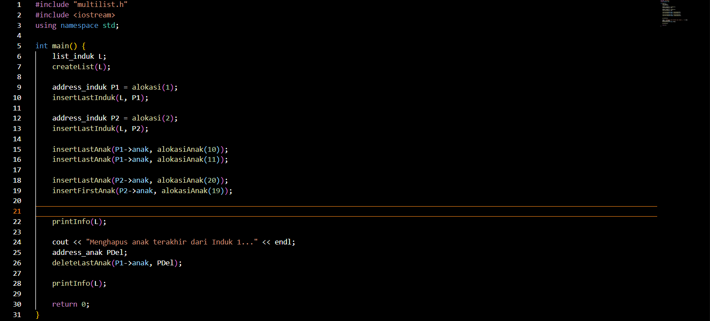

Penjelasan : Kode ini adalah program utama yang digunakan untuk menguji operasi pada ADT Multilist, yang terdiri dari list induk dengan masing-masing memiliki list anak. Program dimulai dengan membuat sebuah list_induk dan menginisialisasinya menggunakan createList. Selanjutnya dibuat dua elemen induk dengan nilai 1 dan 2, yang kemudian ditambahkan ke bagian belakang list menggunakan insertLastInduk. Untuk induk pertama, dua elemen anak dengan nilai 10 dan 11 ditambahkan melalui insertLastAnak, sehingga keduanya berada di urutan belakang list anak milik induk tersebut. Untuk induk kedua, dua anak juga ditambahkan: anak bernilai 20 dimasukkan di belakang menggunakan insertLastAnak, sedangkan anak bernilai 19 disisipkan di depan menggunakan insertFirstAnak, sehingga menjadi elemen pertama pada list anak milik induk kedua. Setelah semua data berhasil ditambahkan, fungsi printInfo dipanggil untuk menampilkan seluruh struktur multilist. Program kemudian melanjutkan dengan operasi penghapusan, yaitu menghapus elemen anak terakhir dari induk pertama menggunakan deleteLastAnak. Node yang terhapus disimpan pada variabel PDel. Setelah proses penghapusan selesai, list kembali ditampilkan menggunakan printInfo untuk memperlihatkan perubahan pada struktur data. Secara keseluruhan, kode ini mendemonstrasikan cara membuat multilist, menambahkan induk dan anak, serta menghapus elemen anak menggunakan operasi-operasi ADT double linked list.
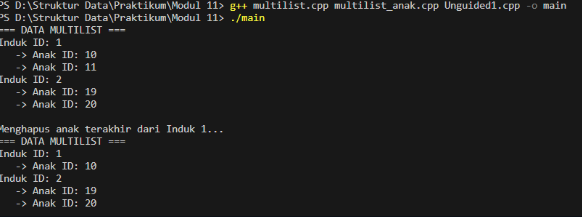

### 5.2 unguided2
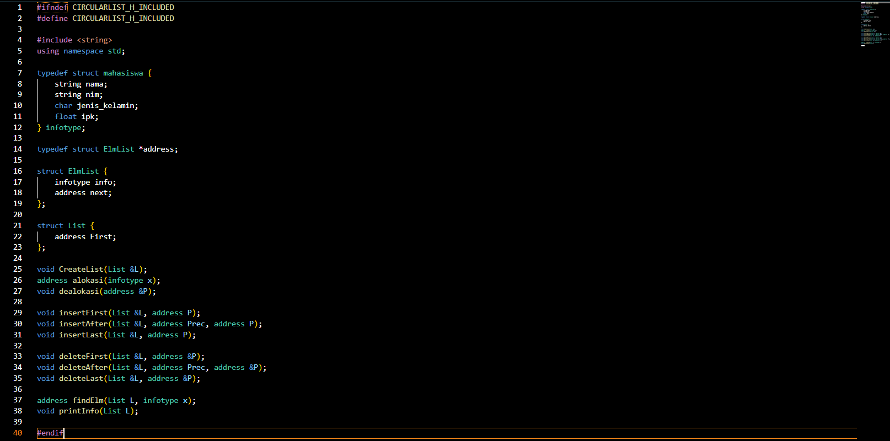
Penjelasan : Kode ini adalah header file untuk membangun ADT Circular Linked List yang digunakan untuk menyimpan data mahasiswa. Setiap elemen list menyimpan informasi berupa nama, NIM, jenis kelamin, dan IPK, yang didefinisikan dalam struktur infotype. Struktur ElmList mewakili node dalam circular list, berisi data mahasiswa dan pointer next yang menunjuk ke elemen berikutnya, di mana elemen terakhir akan menunjuk kembali ke elemen pertama sehingga membentuk list melingkar. Struktur List hanya menyimpan satu pointer yaitu First sebagai penanda awal list. Fungsi CreateList digunakan untuk menginisialisasi list kosong dengan mengatur pointer pertama menjadi NULL. Fungsi alokasi membuat node baru dan mengisi datanya, sedangkan dealokasi digunakan untuk membebaskan memori node yang sudah tidak dipakai. Untuk operasi penyisipan, tersedia insertFirst, insertAfter, dan insertLast yang memungkinkan penambahan node di depan, setelah node tertentu, atau di bagian akhir list sambil tetap mempertahankan struktur circular. Operasi penghapusan dilakukan melalui deleteFirst, deleteAfter, dan deleteLast untuk menghapus node dari posisi tertentu dengan memastikan hubungan circular antar elemen tetap konsisten. Fungsi findElm digunakan untuk mencari elemen berdasarkan data mahasiswa, sedangkan printInfo mencetak seluruh isi circular list mulai dari elemen pertama hingga kembali lagi ke awal. Secara keseluruhan, header ini menyediakan seluruh operasi dasar untuk membangun dan mengelola Circular Linked List yang menyimpan data mahasiswa secara dinamis.

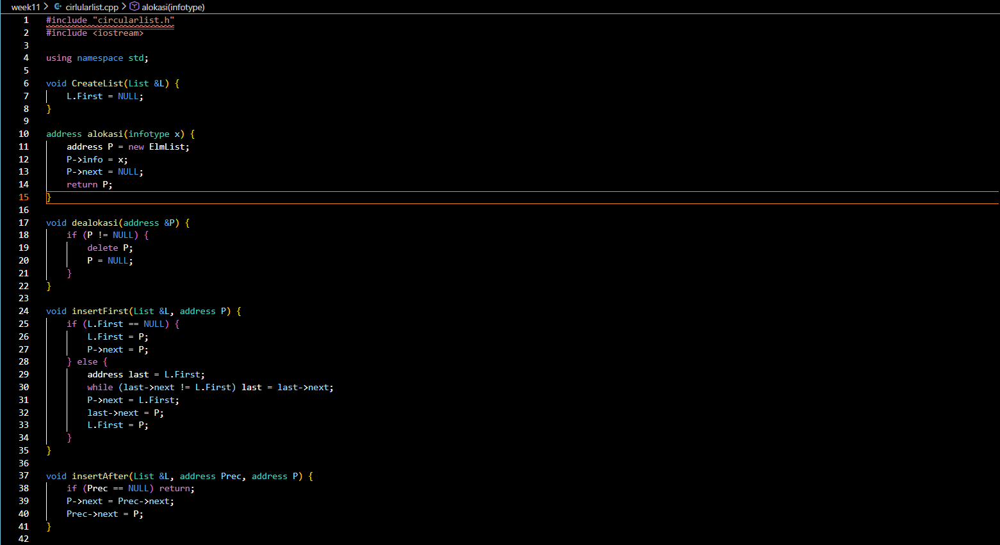
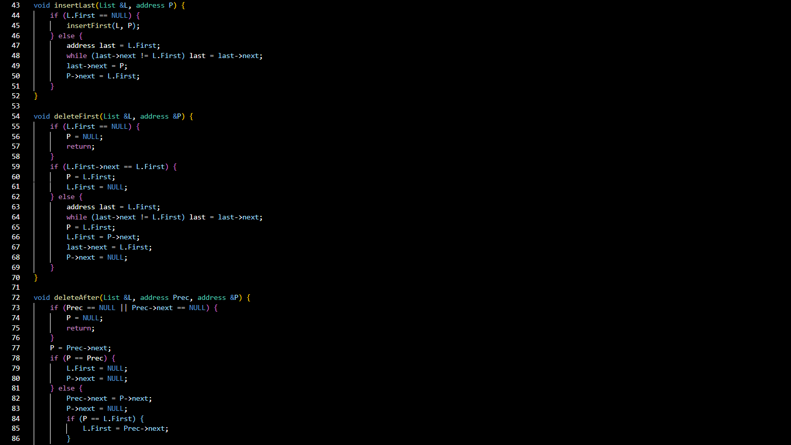
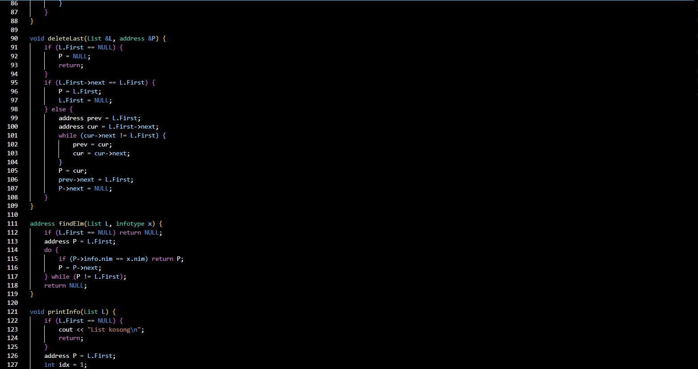
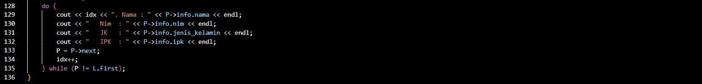

Penjelasan : Kode ini adalah implementasi lengkap dari ADT Circular Linked List yang digunakan untuk menyimpan dan mengelola data mahasiswa. Fungsi CreateList menginisialisasi list agar kosong dengan mengatur pointer First menjadi NULL. Fungsi alokasi membuat node baru berisi data mahasiswa dan mengatur pointer next menjadi NULL, sedangkan dealokasi digunakan untuk menghapus node dan membebaskan memori. Operasi penyisipan elemen dilakukan melalui beberapa fungsi: insertFirst menambahkan node di bagian awal list dengan menjaga agar node terakhir tetap menunjuk kembali ke elemen pertama, insertAfter menyisipkan node setelah elemen tertentu, dan insertLast menambahkan node di posisi terakhir sebelum kembali ke First. Untuk penghapusan elemen, tersedia deleteFirst yang menghapus node pertama dengan memperbarui pointer First dan menjaga hubungan circular, deleteAfter yang menghapus node setelah elemen tertentu, serta deleteLast yang menghapus node paling akhir dan mengatur ulang node sebelumnya agar menunjuk ke First. Fungsi findElm digunakan untuk mencari data mahasiswa berdasarkan NIM dengan melakukan traversing mengelilingi list hingga kembali ke node pertama. Terakhir, printInfo digunakan untuk menampilkan seluruh isi circular linked list, mencetak data mahasiswa dari elemen pertama hingga kembali ke awal list. Secara keseluruhan, kode ini memberikan semua operasi penting untuk membangun, menambah, menghapus, mencari, dan mencetak elemen dalam struktur circular linked list.

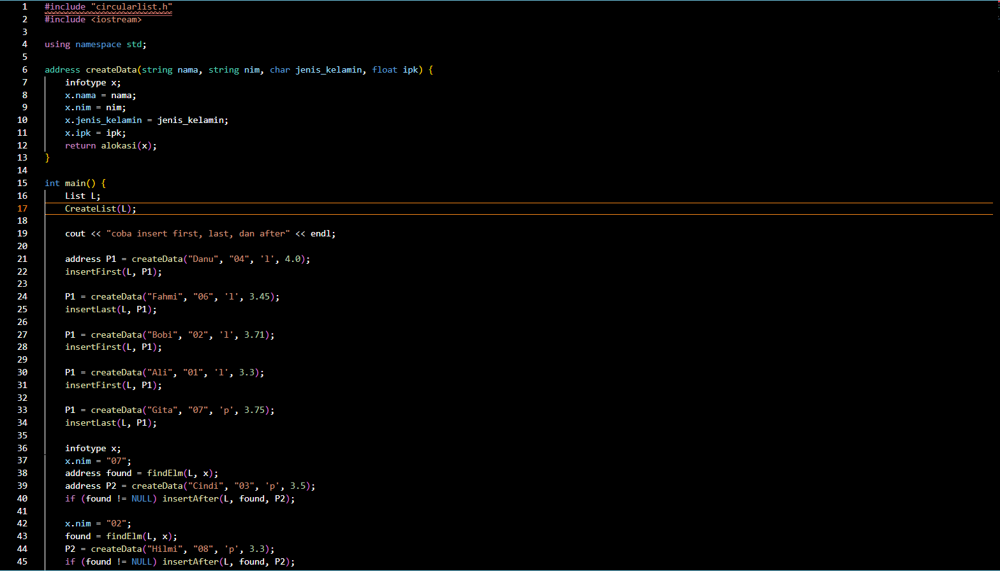
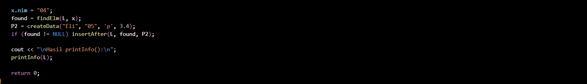

### output
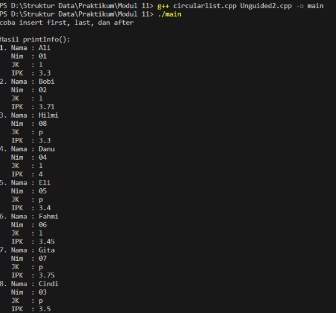

## 6. Kesimpulan
Jadi berdasarkan pemahaman dan implementasi struktur data pada program di atas, dapat disimpulkan bahwa tujuan pembelajaran mengenai penerapan Circular Linked List telah berhasil dicapai. Melalui berbagai operasi seperti insertFirst, insertLast, insertAfter, deleteFirst, deleteLast, deleteAfter, serta findElm, saya mampu memahami bagaimana sebuah list dapat dikelola secara dinamis menggunakan pointer. Circular Linked List memiliki karakteristik khusus, yaitu node terakhir selalu menunjuk kembali ke node pertama, sehingga membentuk struktur melingkar. Konsep ini memberikan keuntungan berupa kemudahan traversal tanpa titik akhir serta efisiensi dalam operasi penyisipan dan penghapusan, karena tidak memerlukan pergeseran elemen seperti pada struktur data berbasis array. Selain itu, penggunaan fungsi-fungsi terpisah pada header membuat program lebih terstruktur, mudah dipahami, dan sesuai dengan prinsip modularisasi dalam pemrograman. Dengan demikian, praktikum ini memberikan pemahaman yang kuat mengenai konsep dasar, operasi fundamental, dan penerapan nyata dari Circular Linked List dalam bahasa C++.

## 7. Referensi
1. Sjafari, A. N., & Mulyani, A. (2018). IMPLEMENTASI DOUBLE LINKED LIST PADA APLIKASI ANTRIAN KLINIK. Jurnal Ilmiah Informatika, 3(01)
2. Wijoyo, A., Prayudi, L. A., Fiqih, M., Santoso, R. D., Putra, R. T., Arifin, T., & Farhan, A. (2024). Penggunaan Algoritma Doubly Linked List Untuk Insertion Dan Deletion. JRIIN : Jurnal Riset Informatika dan Inovasi, 1(12), 1329–1331.
3. https://www.tutorialspoint.com/cplusplus/
    