# Laporan Praktikum Struktur Data

## 1. Nama, NIM, Kelas
- **Nama**: M Rafi Maulana Fadlurrahman
- **NIM**: 103112400264
- **Kelas**: IF12-05

## 2. Motivasi Belajar Struktur Data
Struktur Data merupakan salah satu fondasi penting dalam ilmu komputer. Oleh karena itu, saya berkomitmen untuk mempelajarinya secara mendalam agar dapat meningkatkan kemampuan analisis dan pemrograman saya.

## 3. Dasar Teori
truktur data adalah cara untuk menyimpan dan mengorganisir data dalam komputer agar dapat digunakan secara efisien. Berikut adalah teori dasar mengenai Graph:

Graph merupakan himpunan tidak kosong yang terdiri dari elemen node (vertex) dan garis penghubung (edge). Konsep ini sering diilustrasikan dalam kehidupan sehari-hari, misalnya lokasi tempat kost dan laboratorium dianggap sebagai node, sementara jalan yang menghubungkan keduanya adalah edge. Dalam implementasi teknisnya, struktur node induk berisi informasi data itu sendiri, sedangkan struktur node anak atau edge menyimpan informasi berupa alamat memori (address) yang merujuk pada node induk atau node tujuan untuk membentuk sebuah relasi.

Berdasarkan arah hubungannya, graph dibedakan menjadi Directed Graph (graph berarah) dan Undirected Graph (graph tidak berarah). Pada graph berarah, setiap garis penghubung memiliki orientasi tertentu, sehingga jika node A terhubung ke node B, hubungan sebaliknya belum tentu berlaku; berbeda dengan graph tak-berarah di mana hubungan antar node bersifat otomatis bolak-balik tanpa arah spesifik. Representasi graph dalam memori komputer dapat dilakukan menggunakan Matriks Ketetanggaan (Array 2 Dimensi) atau Multi Linked List, namun metode Multi Linked List lebih disukai dan digunakan dalam praktikum ini karena sifat dinamisnya yang mampu menangani perubahan jumlah data secara efisien.

Aspek penting lainnya dalam pemahaman graph adalah konsep ketetanggaan, di mana node A dikatakan bertetangga dengan node B jika keduanya dihubungkan langsung oleh sebuah edge. Untuk mengunjungi atau menelusuri setiap node dalam graph, digunakan metode standar seperti Breadth First Search (BFS) dan Depth First Search (DFS). BFS bekerja dengan mengunjungi node level demi level mulai dari root (kedalaman 0) lalu melebar ke tetangganya, sedangkan DFS bekerja dengan menelusuri satu jalur hingga ke simpul terdalam (subtree) secara rekursif sebelum kembali ke simpul sebelumnya.
## 4. Guided
### 4.1 Guided 1
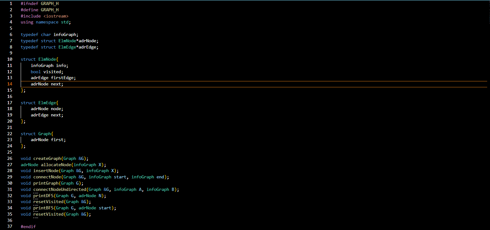

Penjelasan : Kode ini adalah header file ADT Graph yang menggunakan representasi adjacency list. Graph terdiri dari kumpulan node dan edge yang menunjukkan hubungan antar node. Setiap node disimpan dalam list utama dan memiliki list edge sendiri yang menunjuk ke node lain yang terhubung. Struktur ElmNode menyimpan informasi node, penanda visited untuk keperluan DFS dan BFS, pointer ke edge pertama, serta pointer ke node berikutnya. Struktur ElmEdge digunakan untuk menyimpan hubungan antar node, sedangkan struktur Graph menyimpan pointer ke node pertama dalam graph. Header ini menyediakan fungsi dasar seperti pembuatan graph, penambahan node, penghubungan node (berarah dan tidak berarah), serta fungsi untuk menampilkan isi graph. Selain itu, tersedia juga fungsi DFS dan BFS untuk menelusuri graph, serta fungsi resetVisited untuk mengatur ulang status kunjungan node. Dengan demikian, file ini menjadi dasar untuk membangun dan mengelola struktur data graph.
### 4.1 Guided 2
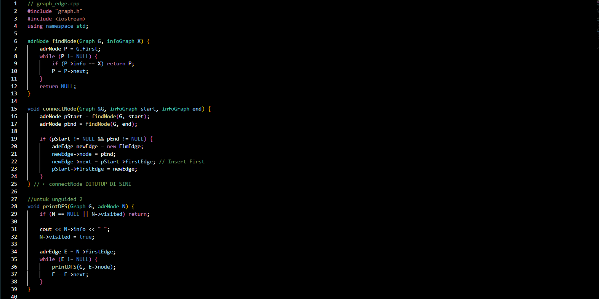
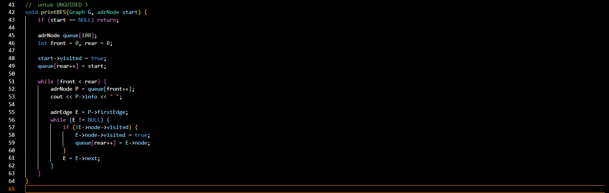

Penjelasan : Kode ini adalah implementasi operasi edge pada ADT Graph yang menggunakan representasi adjacency list. Graph disusun dari kumpulan node, di mana setiap node dapat terhubung dengan node lain melalui edge. Fungsi findNode digunakan untuk mencari node tertentu di dalam graph berdasarkan nilai informasinya. Fungsi connectNode berfungsi untuk menghubungkan dua node secara berarah, yaitu dari node awal ke node tujuan dengan menambahkan edge ke dalam list edge milik node awal. Penambahan edge dilakukan di bagian akhir adjacency list agar urutan hubungan sesuai dengan urutan input. Selain itu, fungsi connectNodeUndirected digunakan untuk membentuk graph tidak berarah, yaitu dengan menambahkan dua edge sekaligus sehingga kedua node saling terhubung. Dengan demikian, kode ini menyediakan mekanisme dasar untuk membangun hubungan antar node pada graph, baik berarah maupun tidak berarah.
### 4.3 Guided 3
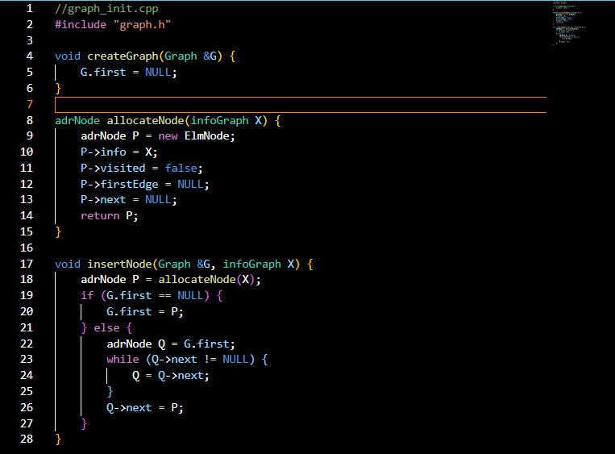

Penjelasan : Kode ini adalah implementasi operasi dasar pada ADT Graph yang berkaitan dengan pembuatan dan pengelolaan node. Fungsi createGraph digunakan untuk menginisialisasi graph agar berada dalam kondisi kosong dengan mengatur pointer awal bernilai NULL. Fungsi allocateNode berfungsi untuk membuat node baru dengan mengisi data, mengatur status visited menjadi false, serta menginisialisasi pointer edge dan pointer ke node berikutnya. Fungsi insertNode digunakan untuk menambahkan node baru ke dalam graph. Node disisipkan ke bagian akhir list node sehingga urutan node sesuai dengan urutan penambahan. Dengan demikian, kode ini menyediakan fungsi dasar untuk membangun struktur graph sebelum node-node tersebut dihubungkan dengan edge.induk yang relevan.

### 4.3 Guided 4
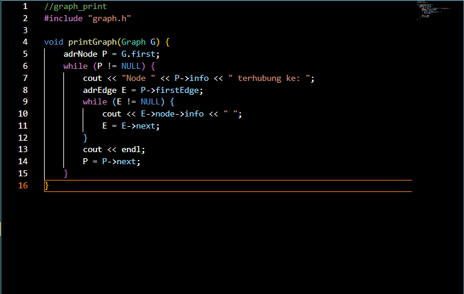

### 4.3 Guided 5
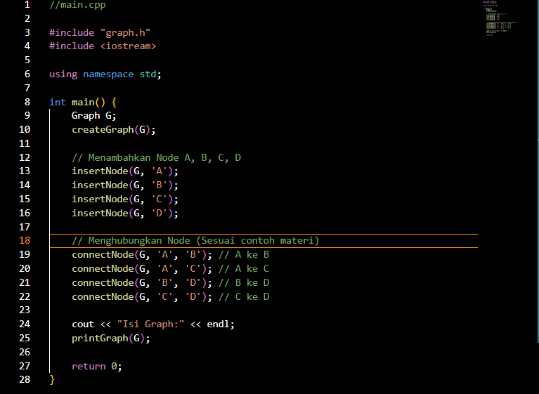

Penjelasan : Kode ini adalah program utama (main) yang digunakan untuk menguji implementasi ADT Graph. Pada awal program, graph dibuat dan diinisialisasi agar dalam keadaan kosong. Selanjutnya, beberapa node dimasukkan ke dalam graph, yaitu node A, B, C, dan D. Setelah node berhasil ditambahkan, program menghubungkan node-node tersebut menggunakan fungsi connectNode sehingga terbentuk hubungan antar node sesuai dengan struktur graph berarah. Terakhir, fungsi printGraph digunakan untuk menampilkan isi graph beserta hubungan antar node ke layar. Dengan demikian, program ini berfungsi sebagai contoh penggunaan ADT Graph untuk membangun dan menampilkan struktur graph sederhana.

output:
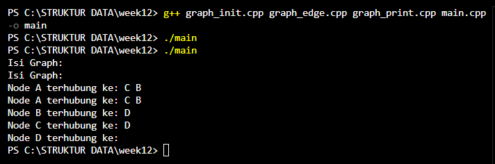

## 5. Unguided
### 5.1 unguided1
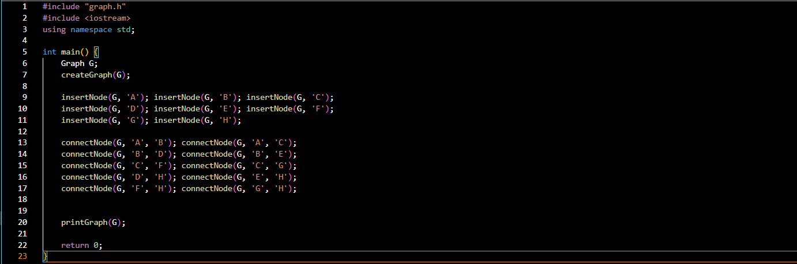

Pada Unguided 1 dilakukan pembuatan struktur data graph menggunakan adjacency list, di mana setiap node disimpan dalam bentuk linked list dan setiap edge direpresentasikan sebagai list sisi dari node asal. Program dimulai dengan inisialisasi graph, kemudian dilakukan penambahan node dari A sampai H menggunakan fungsi insertNode. Setelah itu, hubungan antar node dibentuk menggunakan fungsi connectNode, yang menghubungkan satu node ke node lainnya secara terarah. Hasil dari struktur graph yang terbentuk ditampilkan menggunakan fungsi printGraph, sehingga dapat terlihat node mana saja yang saling terhubung sesuai dengan edge yang telah dibuat.
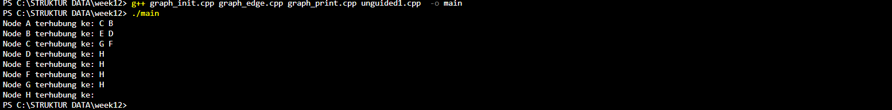
### 5.2 unguided2
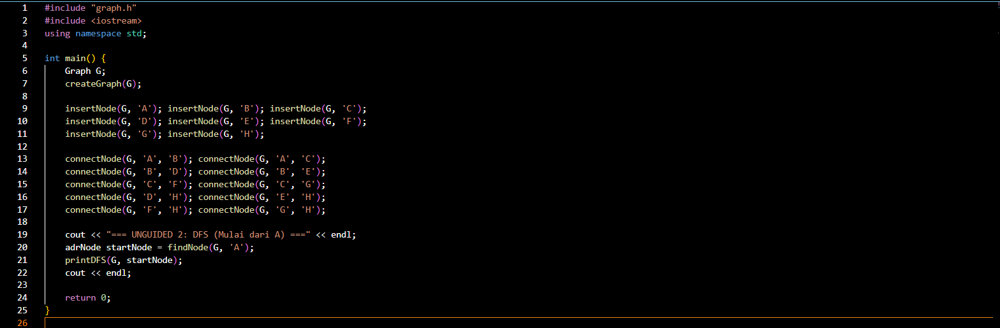
 Unguided 2 dilakukan penelusuran graph menggunakan algoritma Depth First Search (DFS) dengan titik awal node A. DFS bekerja dengan cara mengunjungi satu node, kemudian menelusuri node tetangganya secara mendalam hingga tidak ada lagi node yang dapat dikunjungi, sebelum kembali ke node sebelumnya. Penelusuran ini dilakukan secara rekursif dengan memanfaatkan atribut visited pada setiap node untuk mencegah pengunjungan ulang pada node yang sama. Hasil penelusuran DFS ditampilkan dalam urutan kunjungan node berdasarkan kedalaman terlebih dahulu.
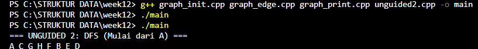

### 5.3 unguided3
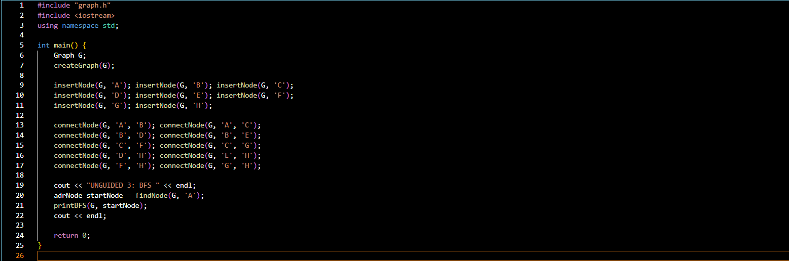
Unguided 3 dilakukan penelusuran graph menggunakan algoritma Breadth First Search (BFS) yang dimulai dari node A. Berbeda dengan DFS, BFS menelusuri graph secara melebar dengan mengunjungi seluruh node pada satu level terlebih dahulu sebelum berpindah ke level berikutnya. Proses ini dibantu oleh struktur data queue, sehingga node yang pertama masuk akan diproses lebih dahulu. Setiap node yang telah dikunjungi akan ditandai sebagai visited untuk menghindari pengulangan. Urutan hasil BFS menunjukkan pola penelusuran berdasarkan jarak terdekat dari node awal.

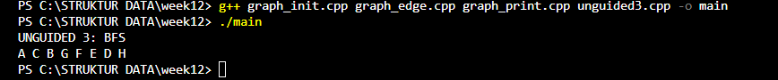

## 6. Kesimpulan
Jadi berdasarkan pemahaman dan implementasi struktur data pada program di atas, Berdasarkan ketiga unguided yang telah dilakukan, dapat disimpulkan bahwa struktur data graph dapat direpresentasikan secara efektif menggunakan adjacency list untuk menyimpan hubungan antar node. Unguided 1 menunjukkan proses pembentukan graph, sedangkan Unguided 2 dan 3 memperlihatkan dua metode penelusuran graph yang berbeda, yaitu DFS dan BFS. DFS lebih menekankan penelusuran secara mendalam, sementara BFS menelusuri graph secara bertingkat. Pemilihan algoritma penelusuran bergantung pada kebutuhan, seperti pencarian jalur terdalam atau pencarian jarak terpendek dari suatu node.

## 7. Referensi
1. Sjafari, A. N., & Mulyani, A. (2018). IMPLEMENTASI DOUBLE LINKED LIST PADA APLIKASI ANTRIAN KLINIK. Jurnal Ilmiah Informatika, 3(01)
2. Wijoyo, A., Prayudi, L. A., Fiqih, M., Santoso, R. D., Putra, R. T., Arifin, T., & Farhan, A. (2024). Penggunaan Algoritma Doubly Linked List Untuk Insertion Dan Deletion. JRIIN : Jurnal Riset Informatika dan Inovasi, 1(12), 1329–1331.
3. https://www.tutorialspoint.com/cplusplus/
    