# Laporan Praktikum Struktur Data

## 1. Nama, NIM, Kelas
- **Nama**: M Rafi Maulana Fadlurrahman
- **NIM**: 103112400264
- **Kelas**: IF12-05

## 2. Motivasi Belajar Struktur Data
Struktur Data merupakan salah satu fondasi penting dalam ilmu komputer. Oleh karena itu, saya berkomitmen untuk mempelajarinya secara mendalam agar dapat meningkatkan kemampuan analisis dan pemrograman saya.

## 3. Dasar Teori
Linked list adalah strukur data linier berbentuk rantai simpul di mana setiap simpul menyimpan 2 item, yaitu nilai data dan pointer ke simpul elemen berikutnya. Berbeda dengan array, elemen linked list tidak ditempatkan dalam alamat memori yang berdekatan melainkan elemen ditautkan menggunakan pointer.

Singly linked list: adalah linked list unidirectional. Jadi, kita hanya dapat melintasinya dalam satu arah, yaitu dari simpul kepala ke simpul ekor.

Doubly linked list: adalah linked list bidirectional. Jadi, kita bisa melintasinya secara dua arah. Tidak seperti singly linked list, simpul doubly linked list berisi satu pointer tambahan yang disebut previous pointer. Pointer ini menunjuk ke simpul sebelumnya.

## 4. Guided
### 4.1 Guided 1
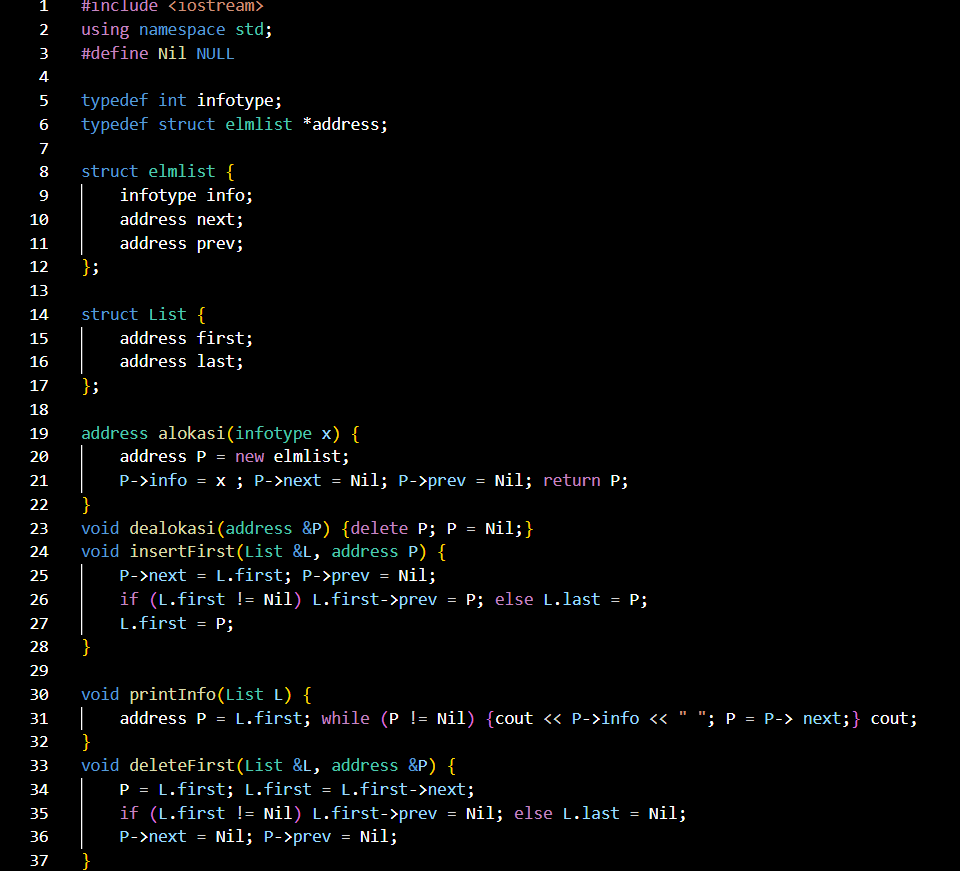
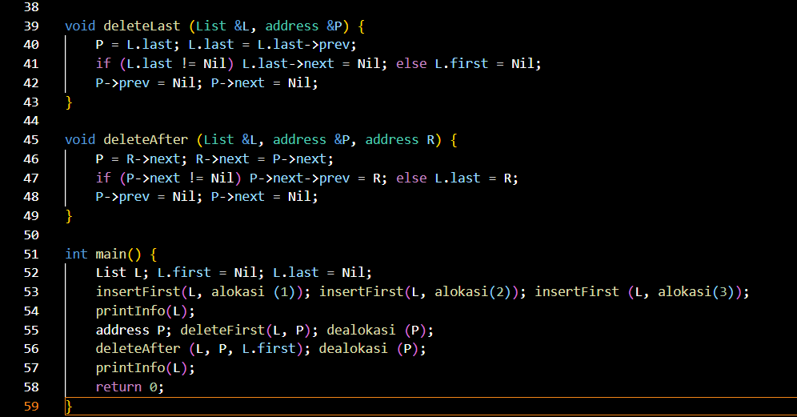

Penjelasan : Program ini membuat dan mengelola Double Linked List (DLL), yaitu struktur data yang tiap elemennya terhubung dua arah. Pertama, program membuat tiga data (1, 2, dan 3) dan menambahkannya ke list di bagian depan, sehingga urutannya menjadi 3 2 1. Setelah itu, elemen pertama (3) dihapus menggunakan deleteFirst, lalu elemen setelah elemen pertama (yaitu 1) dihapus menggunakan deleteAfter. Hasil akhirnya, list hanya menyisakan satu data yaitu 2. Program ini menunjukkan cara menambah dan menghapus elemen dalam Double Linked List dengan benar.

ouput :
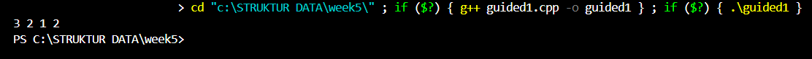
### 4.2 Guided 2
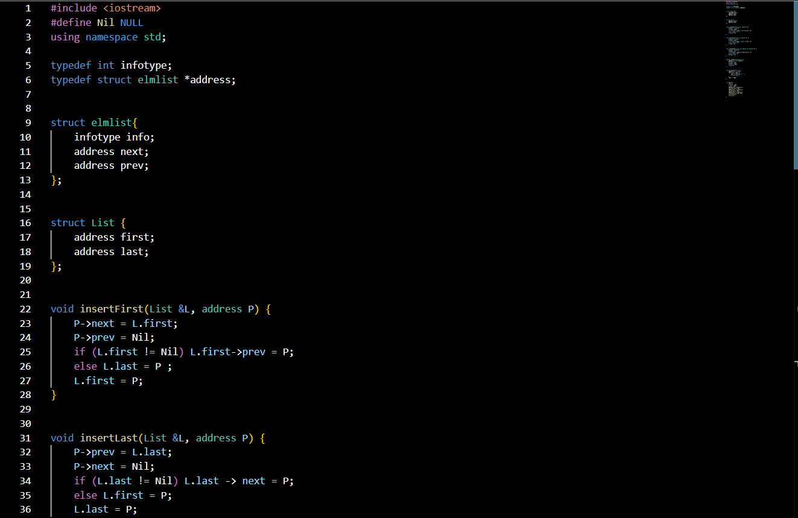
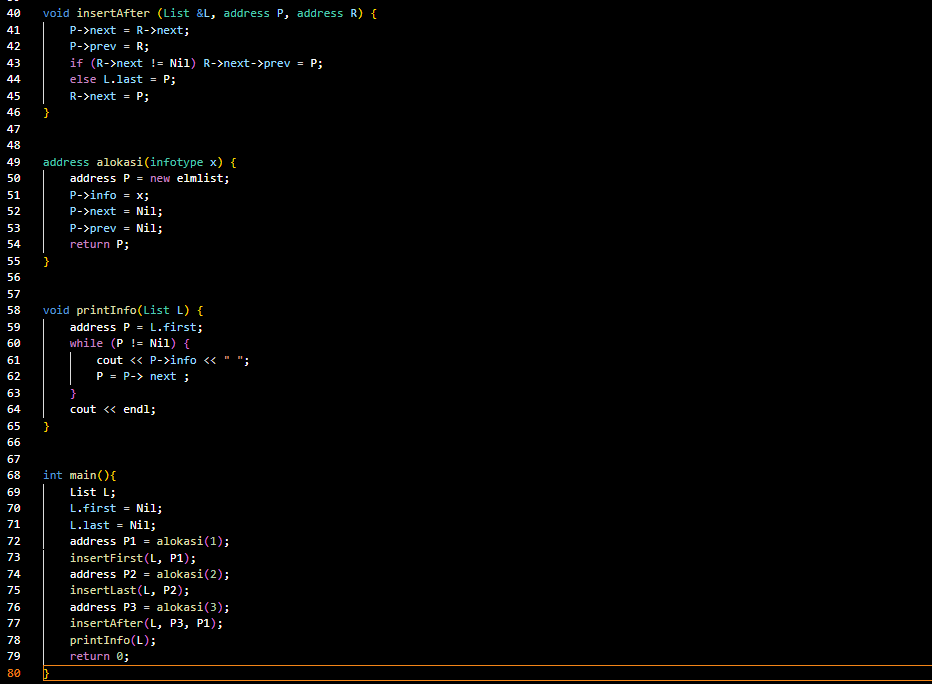

Kode ini menunjukkan cara kerja pointer, yaitu sebuah variabel yang tugasnya bukan menyimpan nilai, melainkan menyimpan alamat memori dari variabel lain. Pertama, program menetapkan hargaProduk senilai 500. Kemudian, sebuah pointer bernama ptrharga dibuat untuk "mencatat" di mana lokasi hargaProduk disimpan. Setelah menampilkan harga awal dan alamat memorinya, program mengubah harga tersebut dengan cara mengaksesnya melalui si pointer (*ptrharga = *ptrharga * 0.9), seolah-olah menyuruh "ubah nilai yang ada di alamat itu". Hasilnya, meskipun yang diubah adalah pointernya, variabel hargaProduk asli ikut berubah menjadi 450 karena mereka terhubung lewat alamat memori yang sama.

output :
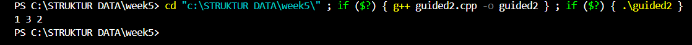

## 5. Unguided
### 5.1 Unguided 1
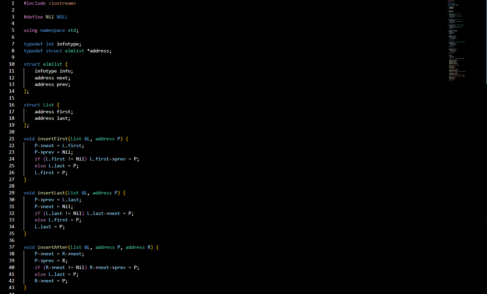
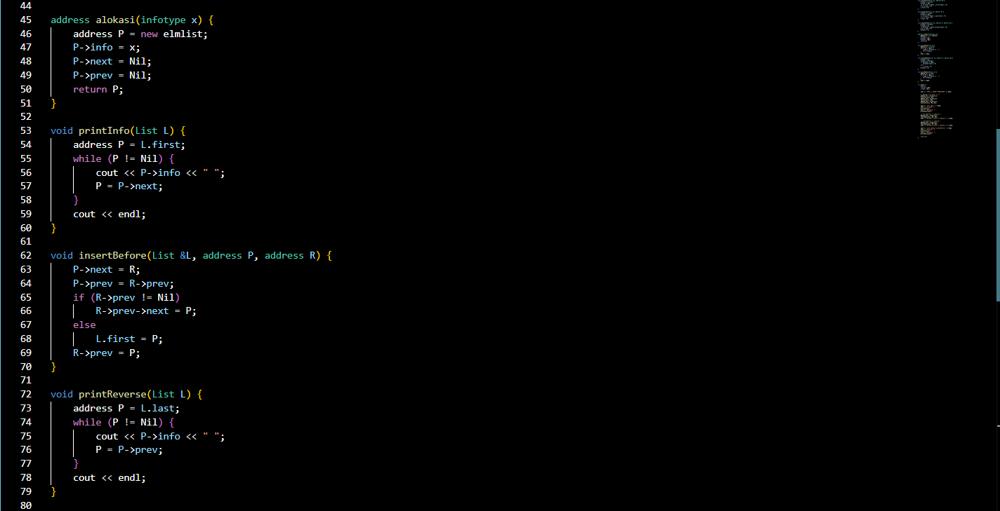
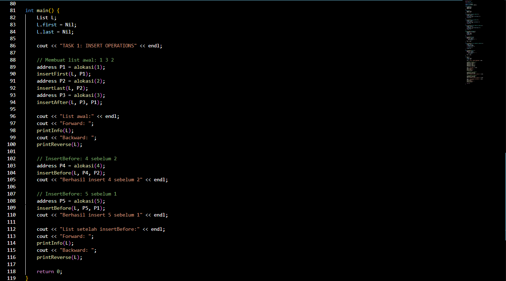

Penjelasan : Program ini implementasi Double Linked List (DLL) yang dapat menambah elemen di awal, akhir, setelah, dan sebelum elemen tertentu. Program ini menggunakan dua struktur utama, yaitu elmlist sebagai node yang menyimpan data serta pointer ke elemen berikut dan sebelumnya, dan List yang menyimpan pointer ke elemen pertama (first) dan terakhir (last). Fungsi alokasi digunakan untuk membuat node baru, sedangkan fungsi insertFirst, insertLast, dan insertAfter digunakan untuk menambah elemen di depan, di belakang, dan setelah elemen tertentu. Fungsi insertBefore digunakan untuk menambah elemen sebelum data yang dicari, dan jika data tersebut tidak ditemukan maka program akan menampilkan pesan kesalahan. Pada fungsi main, list awalnya kosong kemudian ditambahkan data 1 di awal, 2 di akhir, dan 3 setelah 1, sehingga terbentuk urutan 1 3 2. Selanjutnya, angka 4 disisipkan sebelum 2 dan angka 5 disisipkan sebelum 1, menghasilkan urutan akhir 5 1 3 4 2. Program kemudian menampilkan isi list secara maju (forward) dan mundur (backward) untuk menunjukkan bahwa setiap node saling terhubung dua arah dengan benar.

output :
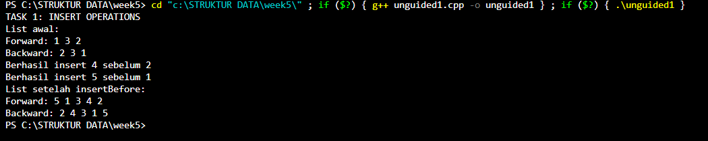
### 5.1 Unguided 2
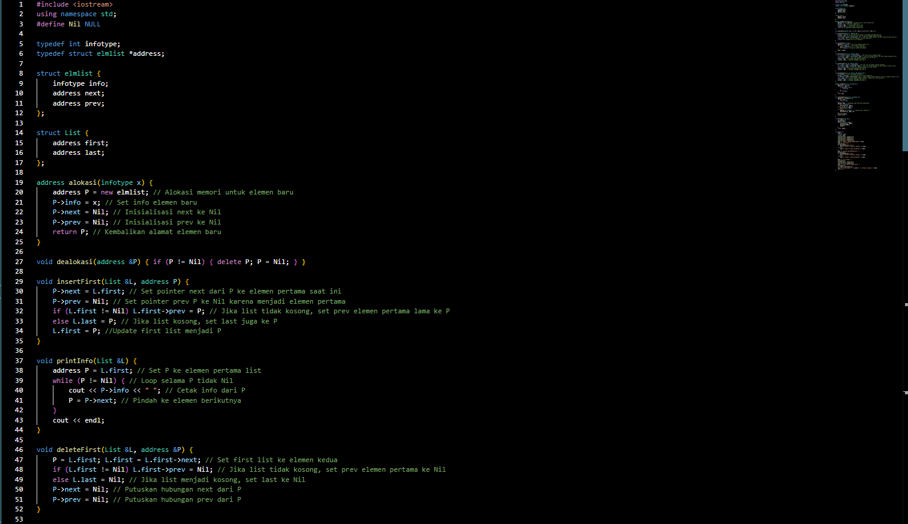
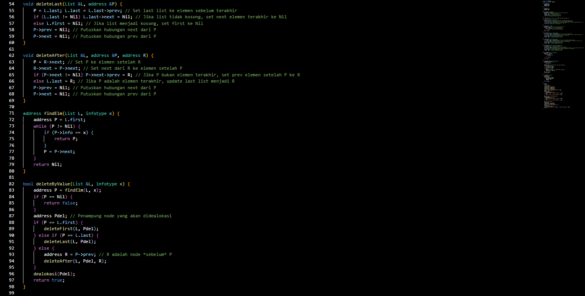
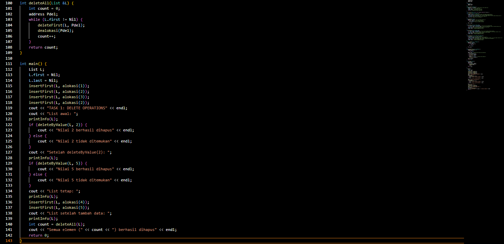

Program ini memanfaatkan beberapa fungsi utama untuk mengelola struktur data linked list. Fungsi alokasi() berperan dalam membuat node baru, sedangkan dealokasi() digunakan untuk menghapus node dari memori. Prosedur insertFirst() menambahkan elemen di bagian awal list, dan printInfo() berfungsi menampilkan seluruh isi list. Untuk proses penghapusan data, terdapat beberapa prosedur: deleteFirst() menghapus elemen pertama, deleteLast() menghapus elemen terakhir, dan deleteAfter() menghapus elemen yang terletak setelah node tertentu. Selain itu, deleteByValue() digunakan untuk mencari dan menghapus elemen berdasarkan nilai yang diberikan, sedangkan deleteAll() berfungsi menghapus seluruh elemen list sekaligus. Dalam fungsi main(), program membuat list yang berisi data 2, 3, 2, dan 1. Selanjutnya, program menghapus elemen bernilai “2”, mencoba menghapus nilai yang tidak terdapat dalam list (yaitu 5), menambahkan beberapa data baru, dan pada tahap akhir, menghapus seluruh elemen yang tersisa dalam list.

output :
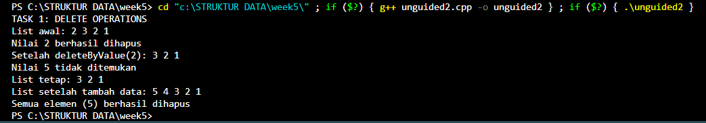

### 5.1 Unguided 3
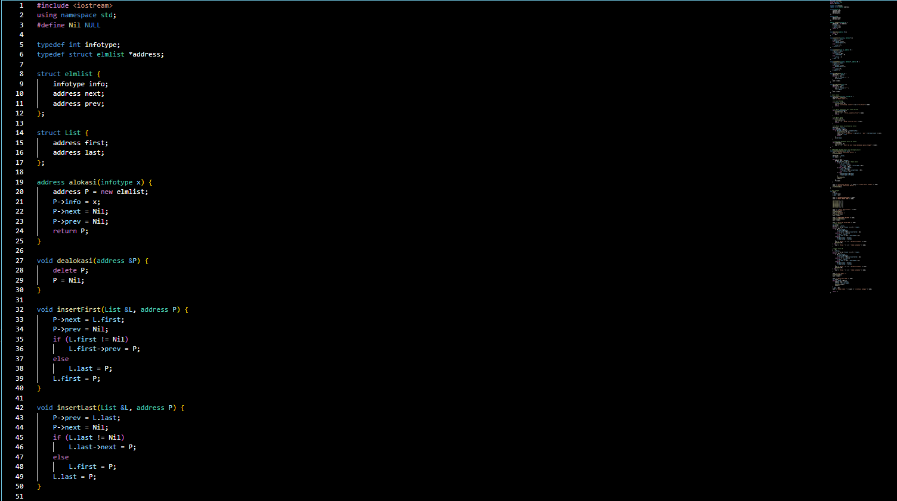
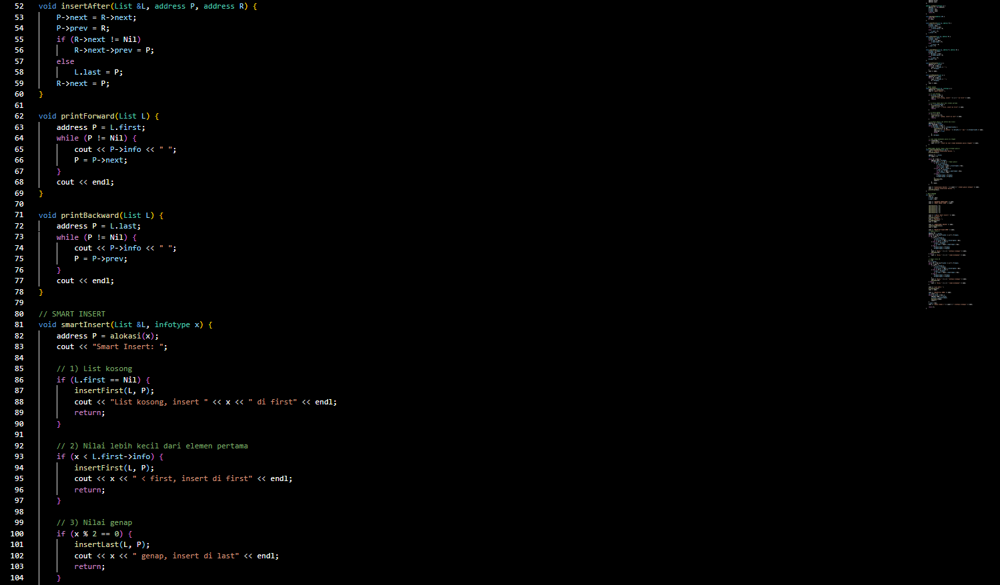
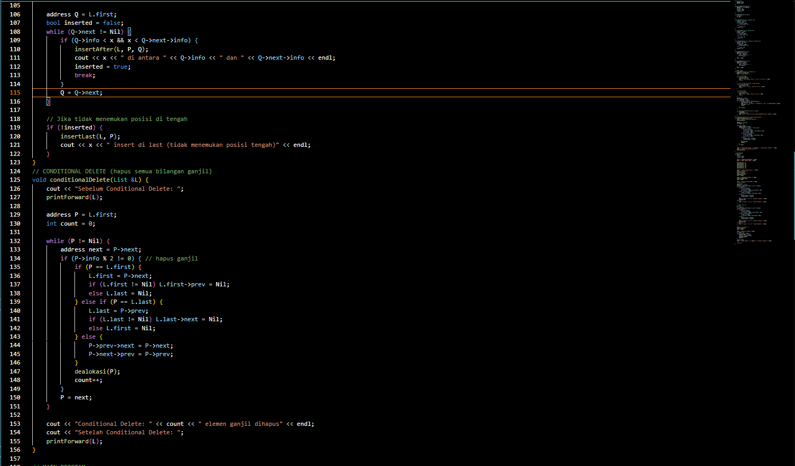
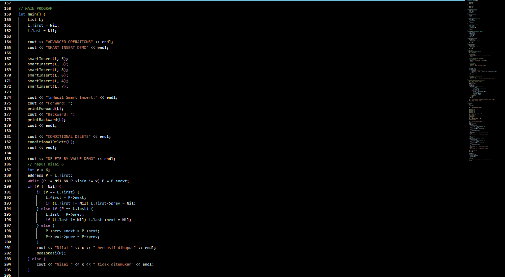
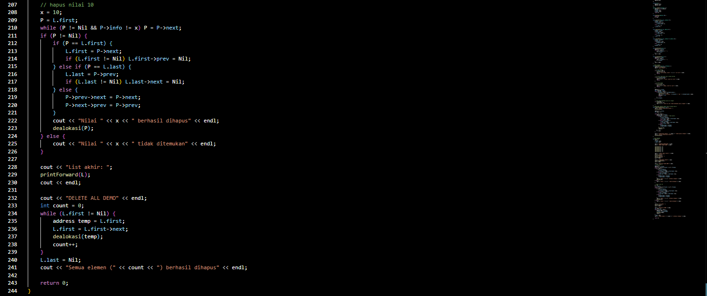

output :
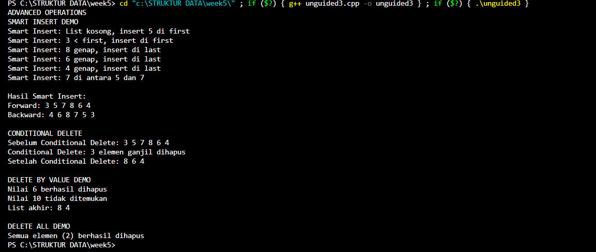

## 6. Kesimpulan
Praktikum ini telah berhasil mengimplementasikan struktur data Doubly Linked List (DLL) secara lengkap. Dimulai dari operasi dasar seperti penyisipan (insertFirst, insertLast, insertAfter, insertBefore) dan penghapusan (deleteFirst, deleteLast, deleteAfter), praktikum ini berkembang hingga mencakup fungsionalitas yang lebih canggih.

Tujuan praktikum tercapai dengan diimplementasikannya fungsi pencarian (findElm), penghapusan berdasarkan nilai (deleteByValue), dan pengosongan list (deleteAll). Puncaknya adalah pembuatan fungsi kondisional kompleks seperti smartInsert (untuk penyisipan cerdas) dan conditionalDelete (untuk menghapus elemen ganjil).

Keseluruhan praktikum ini membuktikan pemahaman mendalam tentang manipulasi pointer next dan prev, pentingnya manajemen memori (alokasi/dealokasi), dan penanganan berbagai edge cases (seperti list kosong atau operasi pada elemen pertama/terakhir).

## 7. Referensi
1. Sjafari, A. N., & Mulyani, A. (2018). IMPLEMENTASI DOUBLE LINKED LIST PADA APLIKASI ANTRIAN KLINIK. Jurnal Ilmiah Informatika, 3(01)
2. Wijoyo, A., Prayudi, L. A., Fiqih, M., Santoso, R. D., Putra, R. T., Arifin, T., & Farhan, A. (2024). Penggunaan Algoritma Doubly Linked List Untuk Insertion Dan Deletion. JRIIN : Jurnal Riset Informatika dan Inovasi, 1(12), 1329–1331.
3. https://www.tutorialspoint.com/cplusplus/
    