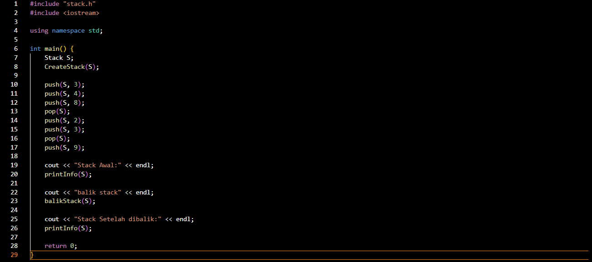
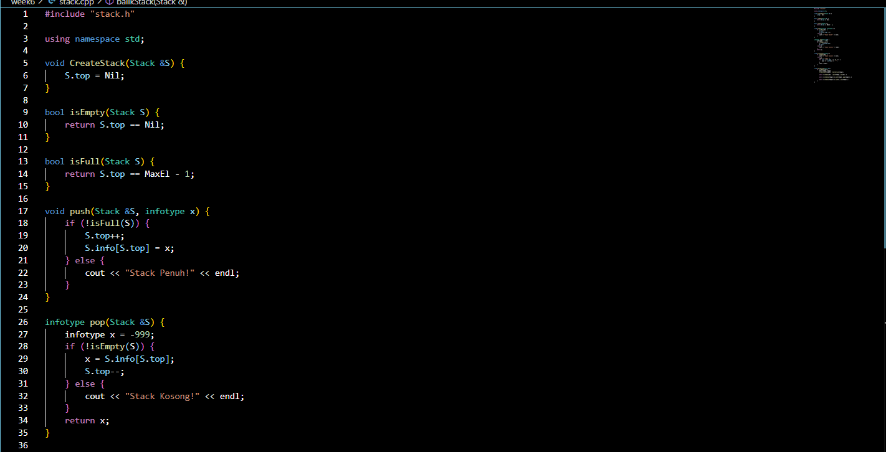
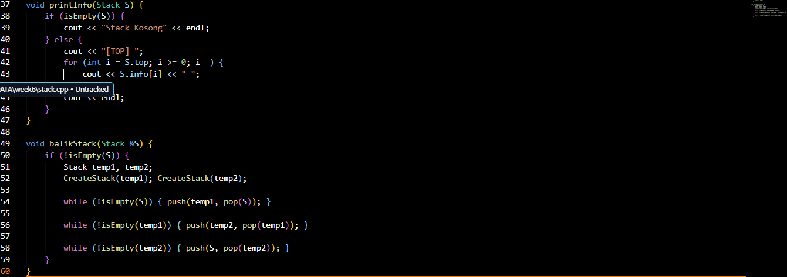
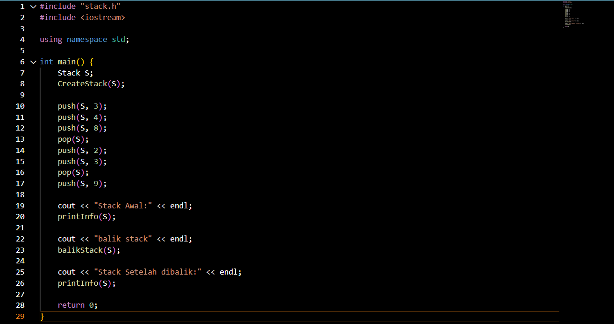
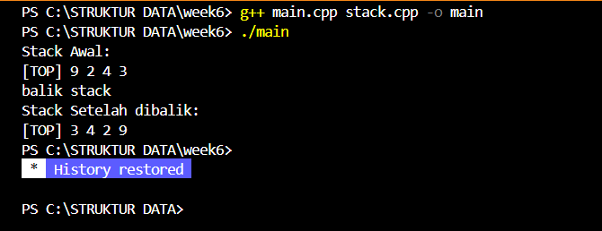
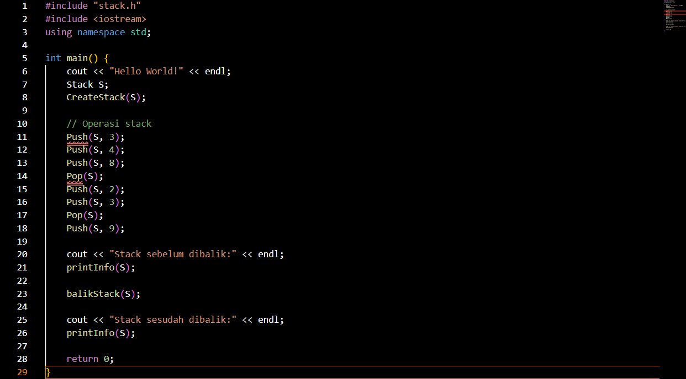
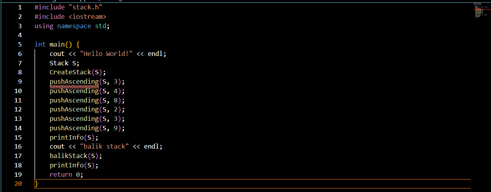
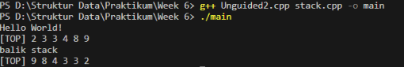
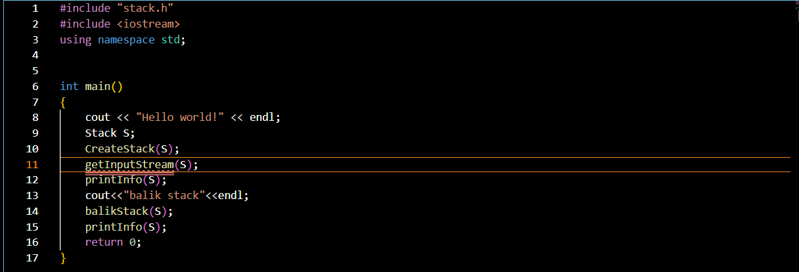
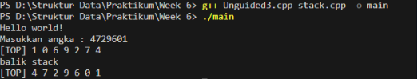

# Laporan Praktikum Struktur Data

## 1. Nama, NIM, Kelas
- **Nama**: M Rafi Maulana Fadlurrahman
- **NIM**: 103112400264
- **Kelas**: IF12-05

## 2. Motivasi Belajar Struktur Data
Saya sangat termotivasi memperlajari struktur data, kenapa saya belajat stuktur data karena saya sadar kalau struktur data itu pondasi yang sangat penting dalam pemrograman contohnya seperti kita akan membangun rumah yang membutuhkan pondasi. Lalu juga banyak aplikasi atau teknologi di dunia nyata contohnya kaya sistem pencarian, manajemen database, sampai ada juga kecerdasan buatan yang bekerja secara efisien dikarenakan menggunakan struktur data yang tepat dan baik. Jadi karena itu saya termotivasi belajar struktur data ini.
## 3. Dasar Teori
Secara sederhana, stack adalah struktur data linier yang digunakan untuk menyimpan sekumpulan objek atau variabel. Setiap penambahan data (push) dan penghapusan data (pop) terjadi di ujung atas tumpukan. Sifat khas stack adalah LIFO (Last In, First Out): data terakhir yang masuk akan menjadi data pertama yang keluar.

Karakteristik utama stack adalah aturan LIFO. Berikut operasi dasar yang biasa diterapkan pada stack:

    Push: Menambahkan elemen baru ke bagian atas stack. Misalnya, menumpuk buku baru di atas tumpukan.
    Pop: Menghapus elemen di puncak stack dan mengembalikan nilainya. Artinya, buku yang paling atas diambil keluar.
    Peek/Top: Melihat (mengintip) elemen teratas tanpa menghapusnya. Seperti mengintip buku paling atas tanpa mengambilnya.
    IsEmpty: Memeriksa apakah stack kosong atau tidak. Cocok seperti mengecek apakah masih ada piring di tumpukan.
    Size: Mengembalikan jumlah elemen dalam stack. Berguna untuk mengetahui seberapa tinggi tumpukan saat ini.

## 4. Guided
### 4.1 Guided 1

Penjelasan : stack.h itu header file yang berisi rancangan struktur data stack (tumpukan) dengan prinsip LIFO (Last In, First Out). Di dalamnya terdapat deklarasi struktur Stack yang menyimpan data dalam array berukuran maksimal 20 elemen (MaxEl = 20) dan variabel top sebagai penanda posisi elemen teratas. Nilai top akan bernilai -1 (Nil) jika stack kosong. stack.h ini juga berisi deklarasi fungsi-fungsi penting seperti CreateStack untuk membuat stack kosong, isEmpty dan isFull untuk mengecek kondisi stack, push untuk menambah data, pop untuk mengambil data teratas, printInfo untuk menampilkan isi stack, serta balikStack untuk membalik urutan isi stack. Secara singkat, stack.h berfungsi sebagai rancangan dasar yang mendefinisikan bentuk dan operasi dasar pada stack, sedangkan implementasi logikanya biasanya ditulis di file lain, yaitu stack.cpp.

### 4.2 Guided 2

File stack.cpp merupakan tempat di mana seluruh fungsi yang telah dideklarasikan di header benar-benar diimplementasikan. Di dalamnya terdapat logika untuk membuat stack baru, menambah dan menghapus elemen, serta menampilkan isi stack ke layar. Fungsi CreateStack mengatur agar stack yang baru dibuat memiliki nilai top bernilai -1 sebagai tanda bahwa masih kosong. Fungsi isEmpty dan isFull digunakan untuk mengecek apakah stack sedang kosong atau penuh. Fungsi push menambahkan elemen ke bagian atas stack jika masih ada ruang, sedangkan pop mengambil elemen teratas dan mengurangi nilai top. Ada pula fungsi printInfo untuk menampilkan isi stack dari elemen paling atas hingga paling bawah, dan fungsi balikStack yang digunakan untuk membalik urutan elemen dalam stack dengan memanfaatkan dua stack sementara.

### 4.2 Guided 3

Penjelasan : Program ini mulai dengan membuat sebuah objek Stack S, lalu memanggil CreateStack(S) untuk menginisialisasi stack agar kosong. Setelah itu, beberapa operasi push dan pop dilakukan untuk menambah dan menghapus elemen pada stack. Urutannya adalah: push 3, push 4, push 8, pop (menghapus 8), push 2, push 3, pop (menghapus 3), dan terakhir push 9. Setelah semua operasi tersebut, program menampilkan isi stack awal melalui printInfo(S). Kemudian program memanggil fungsi balikStack(S) untuk membalik urutan elemen dalam stack. Setelah proses pembalikan selesai, isi stack yang sudah terbalik kembali ditampilkan menggunakan printInfo(S). Secara sederhana, kode ini mendemonstrasikan bagaimana stack dibuat, diisi, dimodifikasi, lalu dibalik, dan hasilnya ditampilkan ke layar.

output: 

## 5. Unguided
### 5.1 Unguided 1

Penjelasan : Program ini implementasi Double Linked List (DLL) yang dapat menambah elemen di awal, akhir, setelah, dan sebelum elemen tertentu. Program ini menggunakan dua struktur utama, yaitu elmlist sebagai node yang menyimpan data serta pointer ke elemen berikut dan sebelumnya, dan List yang menyimpan pointer ke elemen pertama (first) dan terakhir (last). Fungsi alokasi digunakan untuk membuat node baru, sedangkan fungsi insertFirst, insertLast, dan insertAfter digunakan untuk menambah elemen di depan, di belakang, dan setelah elemen tertentu. Fungsi insertBefore digunakan untuk menambah elemen sebelum data yang dicari, dan jika data tersebut tidak ditemukan maka program akan menampilkan pesan kesalahan. Pada fungsi main, list awalnya kosong kemudian ditambahkan data 1 di awal, 2 di akhir, dan 3 setelah 1, sehingga terbentuk urutan 1 3 2. Selanjutnya, angka 4 disisipkan sebelum 2 dan angka 5 disisipkan sebelum 1, menghasilkan urutan akhir 5 1 3 4 2. Program kemudian menampilkan isi list secara maju (forward) dan mundur (backward) untuk menunjukkan bahwa setiap node saling terhubung dua arah dengan benar.

output :

### 5.1 Unguided 2

Penjelasan Program Unguided2.cpp menguji dua operasi stack, yaitu pushAscending untuk menambahkan data secara terurut dan balikStack untuk membalik urutan elemen. Setelah membuat stack S dan mengisinya dengan beberapa nilai, program menampilkan isi stack sebelum dan sesudah dibalik, sehingga memperlihatkan cara stack mengatur dan memanipulasi data secara terstruktur.

output :

### 5.1 Unguided 3

Unguided3.cpp ini adalah program driver yang fokus utamanya adalah untuk menguji fungsionalitas getInputStream(S). Sama seperti yang lain, dia meng-include stack.h dan iostream. Di dalam main, setelah membuat dan menginisialisasi Stack S, program ini langsung memanggil getInputStream(S). Ini artinya, program akan berhenti sejenak dan meminta pengguna untuk mengetikkan serangkaian angka, yang kemudian akan diproses dan dimasukkan ke dalam stack oleh fungsi tersebut. Setelah stack terisi sesuai input pengguna, program memanggil printInfo(S) untuk menampilkan hasilnya. Sebagai langkah pengujian tambahan, program ini kemudian memanggil balikStack(S) untuk membalik isi stack yang baru saja diinput oleh pengguna, dan mencetaknya lagi dengan printInfo(S) untuk menunjukkan kondisi stack setelah dibalik.
output :

## 6. Kesimpulan
Kesimpulannya, Secara keseluruhan enam kode tersebut membentuk satu rangkaian lengkap yang menunjukkan bagaimana struktur data Stack statis berbasis array didefinisikan, diimplementasikan, dan diuji. Pembagian filenya juga tersusun dengan rapi. Pada bagian stack.h, file ini berfungsi sebagai antarmuka yang menjelaskan bentuk struktur Stack—berisi array info[MaxEl] dan variabel TOP—serta mendeklarasikan seluruh fungsi yang akan digunakan di program. Selanjutnya, file stack.cpp menjadi tempat seluruh logika program dijalankan. Di dalamnya terdapat implementasi fungsi-fungsi dasar seperti Push, Pop, IsEmpty, dan IsFull, kemudian dilengkapi juga dengan fungsi tambahan seperti membalik isi stack, memasukkan elemen secara ascending, hingga membaca banyak input sekaligus. Sementara itu, empat file lainnya seperti main.cpp, Unguided1.cpp, Unguided2.cpp, dan Unguided3.cpp berperan sebagai program uji (driver). Tiap file memiliki fokus pengujian yang berbeda: main.cpp dan Unguided1.cpp mencoba operasi dasar stack serta pembalikan urutan, Unguided2.cpp khusus menguji insert dengan aturan ascending, dan Unguided3.cpp digunakan untuk menguji fungsi pembacaan input otomatis. Dengan pembagian tugas seperti ini, seluruh program menggambarkan proses lengkap mulai dari pembuatan struktur stack, implementasi fitur-fiturnya, hingga demonstrasi penggunaannya dalam berbagai skenario.

## 7. Referensi
1.Fathurrozi, M., & WN, H. (2024). Application of Stack Data Structure in Application Development. JASIC (Journal of Applied Science, Informatics, and Computing), 2(1), 1-8.
2. GeeksforGeeks. “Stack Data Structure (Introduction and Implementation).” https://www.geeksforgeeks.org/stack-data-structure/
    