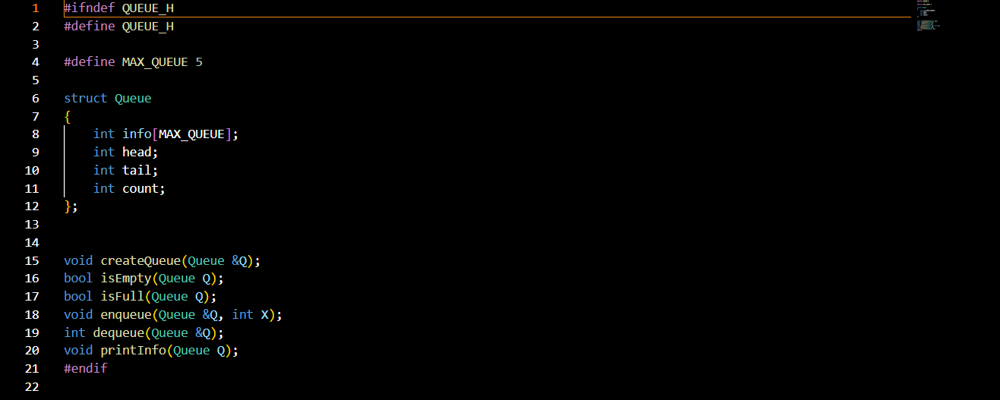
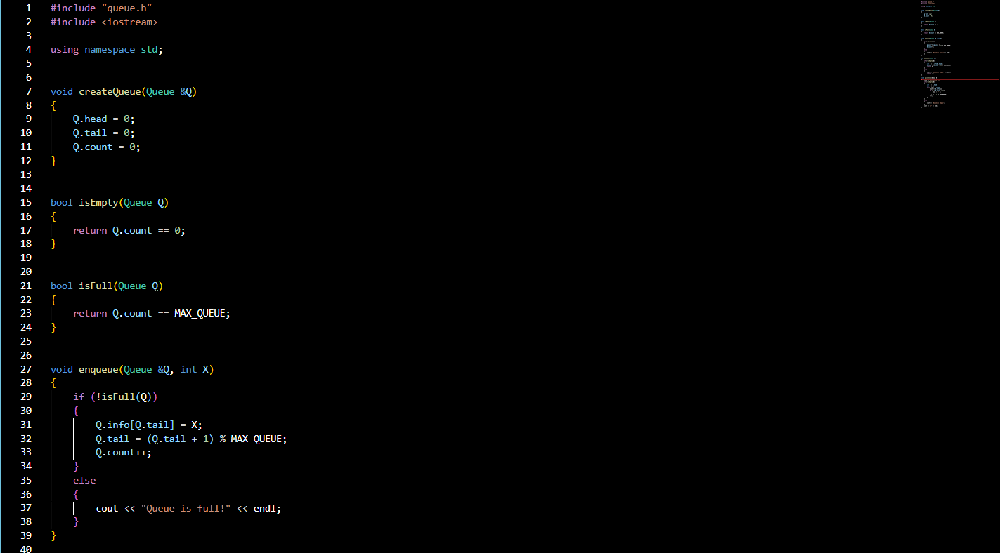
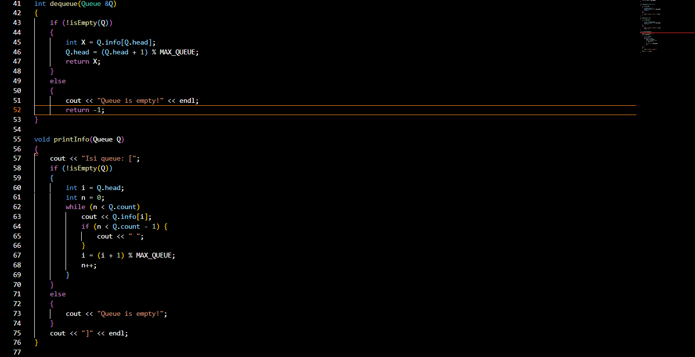
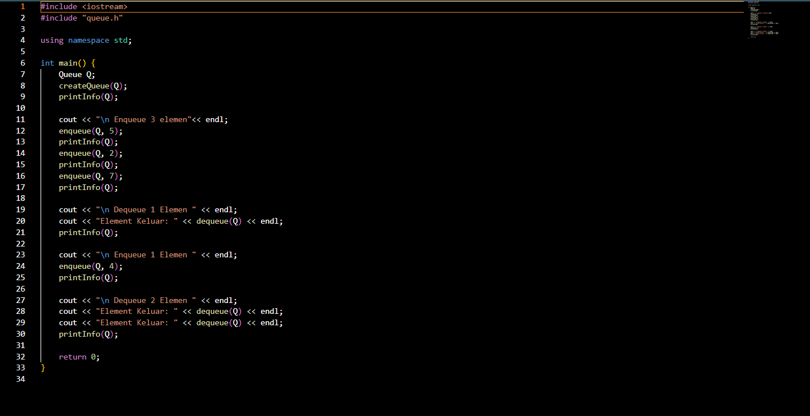
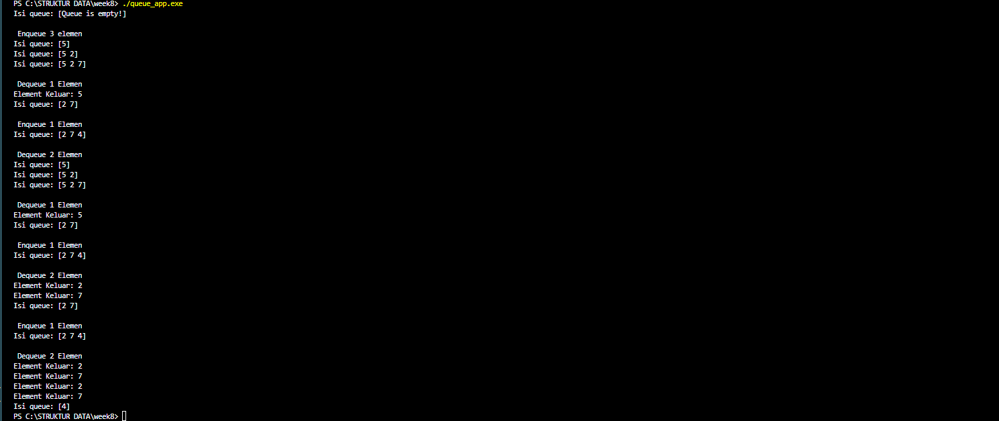
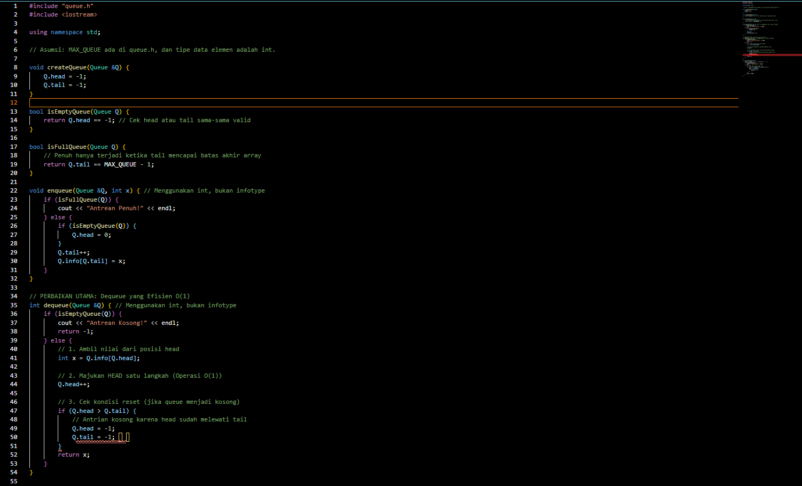
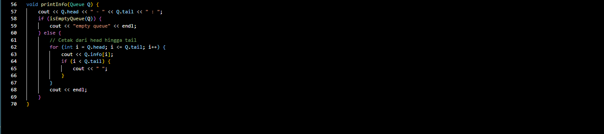
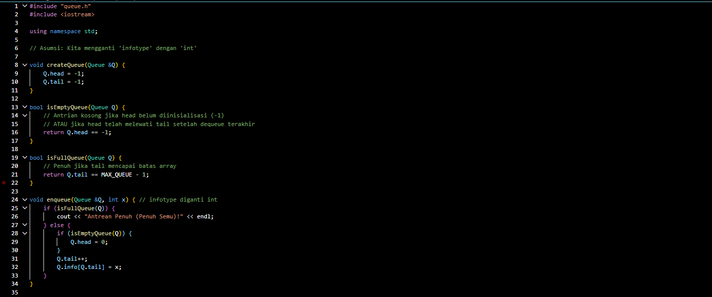
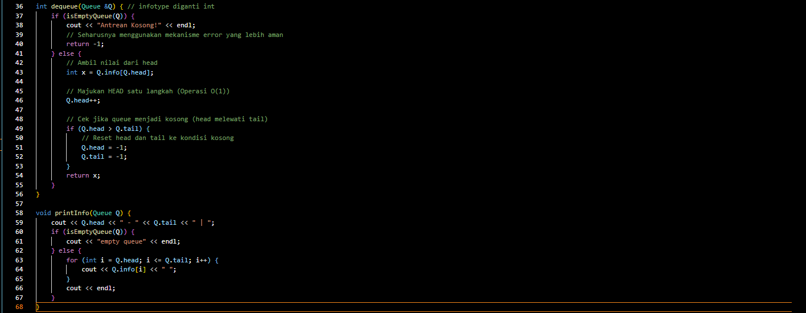
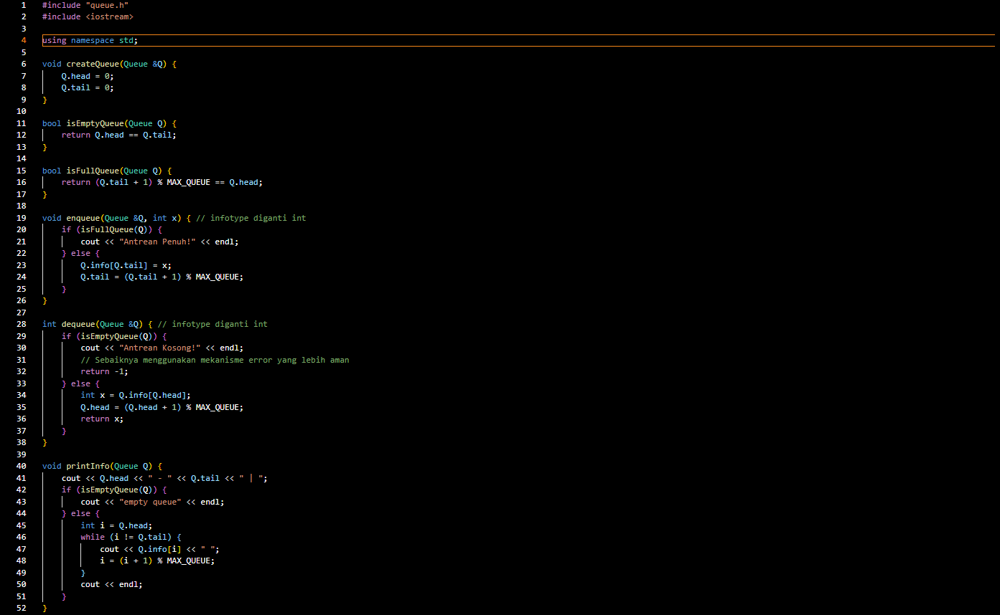

# Laporan Praktikum Struktur Data

## 1. Nama, NIM, Kelas
- **Nama**: M Rafi Maulana Fadlurrahman
- **NIM**: 103112400264
- **Kelas**: IF12-05

## 2. Motivasi Belajar Struktur Data
Struktur Data merupakan salah satu fondasi penting dalam ilmu komputer. Oleh karena itu, saya berkomitmen untuk mempelajarinya secara mendalam agar dapat meningkatkan kemampuan analisis dan pemrograman saya.

## 3. Dasar Teori
Queue adalah struktur data linear yang mengikuti prinsip FIFO (First-In-First-Out) dimana elemen yang pertama dimasukkan akan menjadi elemen pertama yang dikeluarkan. Analogi sederhananya seperti antrean di loket - orang yang datang pertama akan dilayani pertama.

Operasi dasar Queue:

Enqueue: Menambahkan elemen ke bagian belakang (tail) queue

Dequeue: Menghapus elemen dari bagian depan (head) queue

Front/Peek: Melihat elemen terdepan tanpa menghapusnya

isEmpty: Memeriksa apakah queue kosong

isFull: Memeriksa apakah queue penuh

## 4. Guided
### 4.1 Guided 1

File queue.h berfungsi sebagai kontrak atau cetak biru bagi seluruh program Queue Anda. Paragraf ini mendefinisikan struktur data struct Queue yang berisi info (array tempat data disimpan), head, tail, dan count, serta mendeklarasikan semua fungsi yang dapat dilakukan oleh Queue (seperti enqueue, dequeue, isFull, dan isEmpty). Tujuannya adalah untuk memberitahu kompiler dan file lain (seperti main.cpp) tentang keberadaan struktur dan fungsi-fungsi ini, tanpa menjelaskan detail implementasi logikanya.
### 4.2 Guided 2

File queue.cpp adalah pekerja yang berisi semua detail implementasi logika Circular Queue yang dijanjikan dalam queue.h. Paragraf ini menjelaskan "bagaimana" fungsi-fungsi tersebut bekerja; misalnya, enqueue menambahkan elemen ke tail dan dequeue menghapus dari head, di mana kedua operasi tersebut menggunakan operasi modulus (% MAX_QUEUE) untuk memastikan antrian berputar kembali ke awal array saat mencapai akhir. Penggunaan variabel count dalam file ini menjadi kunci untuk membedakan secara jelas apakah Queue sedang dalam kondisi penuh (count == MAX_QUEUE) atau kosong (count == 0).

### 4.3 Guided 3

File main.cpp berperan sebagai pengguna atau penguji yang berfungsi untuk mendemonstrasikan dan memverifikasi fungsionalitas Queue yang telah dibuat. Paragraf ini berisi fungsi utama main() yang menciptakan objek Queue, dan kemudian memanggil urutan operasi secara logis (createQueue, diikuti oleh beberapa enqueue, kemudian dequeue, dan printInfo) untuk menguji apakah implementasi dalam queue.cpp (yang terhubung melalui queue.h) berjalan dengan benar sesuai prinsip FIFO (First-In, First-Out). Ini adalah titik awal eksekusi program.

## 5. Unguided
### 5.1 unguided1

### 5.2 unguided2

### 5.3 unguided3

### output

-Penjelasan Umum-

Berbeda dengan dua implementasi sebelumnya, Queue3 berkerja ketika pointer mencapai akhir array, ia akan kembali ke awal secara otomatis. Implementasi ini mengatasi keterbatasan memori dengan memanfaatkan kembali slot yang telah dikosongkan, menjadikannya sangat efisien untuk aplikasi yang membutuhkan operasi enqueue dan dequeue berulang.

## 6. Kesimpulan
Jadi berdasarkan hasil pengerjaan program di atas, dapat saya simpulkan bahwa tujuan pembelajaran mengenai penerapan struktur data Queue (Antrian) telah berhasil dicapai. Melalui implementasi berbagai operasi seperti enqueue, dequeue, isEmpty, isFull, serta printInfo, saya mampu memahami bagaimana data dapat disimpan dan dikelola menggunakan prinsip FIFO (First In, First Out). Struktur data Queue memungkinkan pengelolaan data secara berurutan, di mana elemen yang masuk lebih dulu akan menjadi yang pertama keluar. Selain itu, penerapan konsep circular queue memberikan efisiensi yang lebih baik karena tidak memerlukan penggeseran elemen secara manual, sehingga operasi berjalan lebih optimal. Penggunaan fungsi-fungsi terpisah juga membuat program lebih rapi, mudah dipahami, dan sesuai dengan konsep modularisasi. Dengan demikian, praktikum ini memberikan pemahaman yang baik mengenai konsep dasar dan penerapan nyata dari struktur data Queue dalam bahasa C++.

## 7. Referensi
1. Sjafari, A. N., & Mulyani, A. (2018). IMPLEMENTASI DOUBLE LINKED LIST PADA APLIKASI ANTRIAN KLINIK. Jurnal Ilmiah Informatika, 3(01)
2. Wijoyo, A., Prayudi, L. A., Fiqih, M., Santoso, R. D., Putra, R. T., Arifin, T., & Farhan, A. (2024). Penggunaan Algoritma Doubly Linked List Untuk Insertion Dan Deletion. JRIIN : Jurnal Riset Informatika dan Inovasi, 1(12), 1329–1331.
3. https://www.tutorialspoint.com/cplusplus/
    